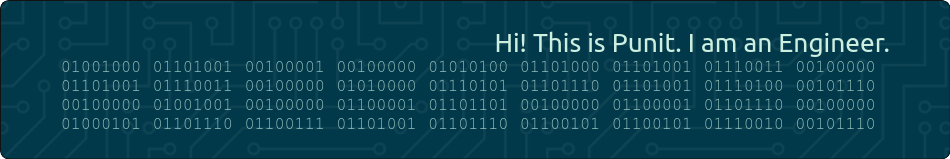

# About Me

Hi! This is Punit. I am an Engineer. I build applications, design light weight - scalable infrasturcture and work on solving machine learning problems during the day @ SAP - which is where I work currently. In my spare time - I play with web3 & blockchain, build pi-net, hack wifi routers, sniff packets & tinker with everything powered with electricity. I graduated with a Bachelor of Science - BS in Electrical Engineering and Computer Sciences (EECS) from University of California @ Berkeley in 2012. I have a dog Pepper (aka Mr. Pepper) - he is ~13.5 years now.


Trying to figure out a good way to document and index important things in life here on this page; instead of wasting my time on XBox.


# Projects

* mrpepper.dog
* msspice.dog
* Raspberry Pi
  * pi-net
  * pi-hole
  * circuit pi
* Model Rail Roading
* TrollMinds
* Hippo
* GrepLabs

# Life Stories

# Interesting Stuff

Here is a list of things I am interested in and a curated index of updated links which I use most of the time (you might find it intersting too then donate so that this website can self sustain).

* Programming Languages - Rust/C/Python/Go/C++/Java/Scala
    * Tutorials
    * Books
    * Hacks
    * Debugging


* Automation, Testing, Integration, Deployment - CI/CD
  * CI
    * Github Actions
  * CD
  * API Testing
  * UI Testing
  * Integration Testing

* Systems Architecture and Design
  * Domains and TLDs
  * Let's Encrypt and SSL Certs
  * TLS 
  * mTLS
  * Service Mesh (Istio Stuff)

* Distributed Sytems
  * Storage
  * Spark
  * Streaming
  * Cassandra

* Machine Learning

* Deep Links 

* Cryptography

* Web3 & Blockchain
 * bitcoins
 * ethereum
 * polygon
 * ripple
 * blockstack
 * dogecoin
 * grepcoin
 * grepchain
 * 
 * ipfs://

* Open Hardware

* Open Source Software

---

If you are wondering how was this page created, here are the step:

- Repository (What is the github.com magic repostiory).
- Configuring your nameservers (for your domain). 
- How to make sure things are https? 
- Tests. 
- Making sure everything is resiliant enough. 
- High level network diagram.
- Making sure the pages really work.    
    ```bash
    echo "Here is the BINARY TEXT from header info png above"
    export BINARY_TXT="01001000 01101001 00100001 00100000 01010100 01101000 01101001 01110011 00100000 01101001 01110011 00100000 01010000 01110101 01101110 01101001 01110100 00101110 00100000 01001001 00100000 01100001 01101101 00100000 01100001 01101110 00100000 01000101 01101110 01100111 01101001 01101110 01100101 01100101 01110010 00101110"

    echo "Well check for yourself!!!" 
    echo "$BINARY_TXT | for a in $BINARY_TXT; do printf "%x" $((2#$a)); done | xxd -r -p"
    ```
