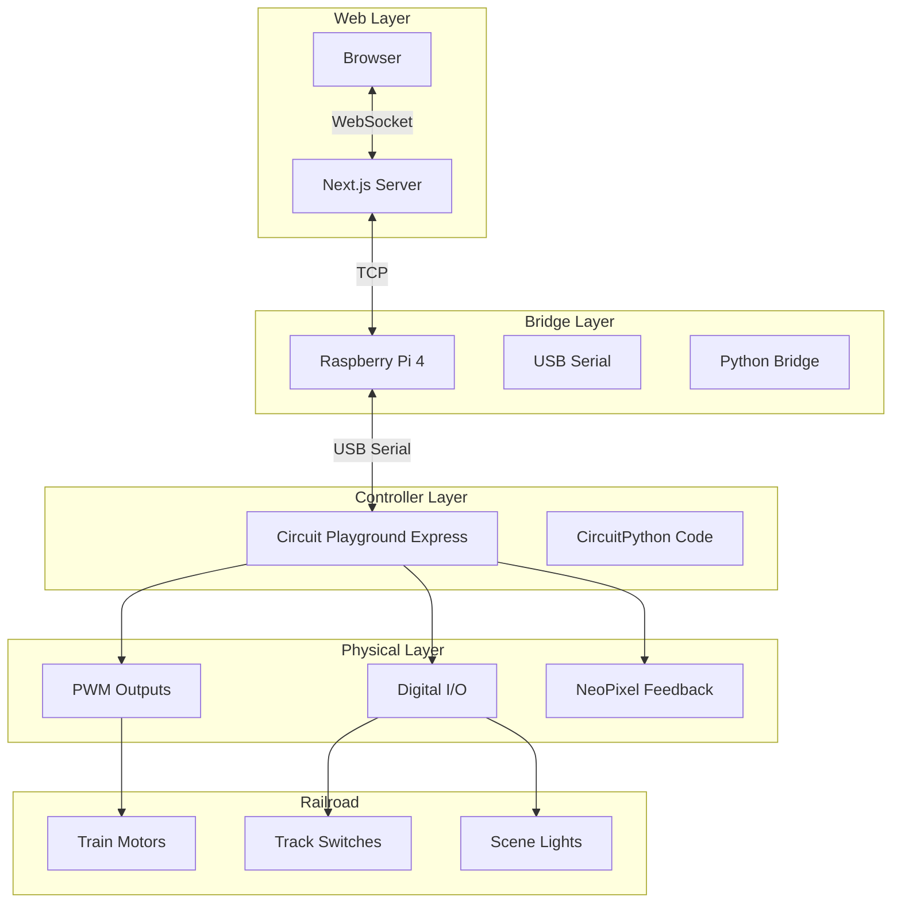
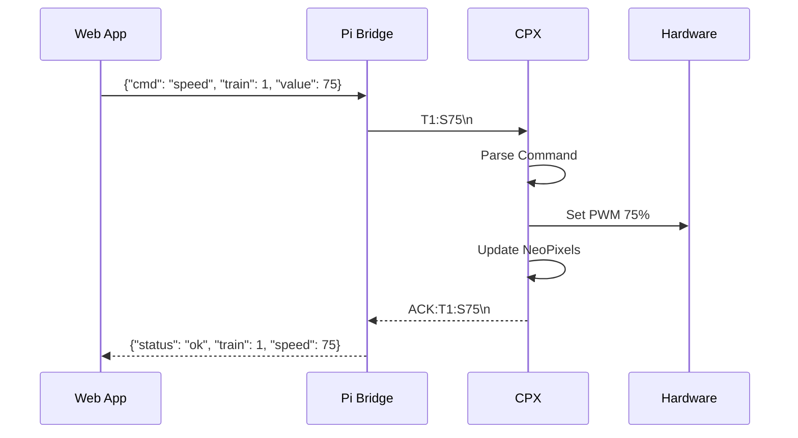

The heart of Railroad Arcade isn't just the web interface—it's the Circuit Playground Express board that translates digital commands into physical train movements. This article covers the CircuitPython code that powers the hardware layer, and why I'm open-sourcing it for the maker community.

## Why Circuit Playground Express?

When designing the hardware controller for Railroad Arcade, I evaluated several options:

| Board | Cost | GPIO | Wireless | Dev Experience |
|-------|------|------|----------|----------------|
| Arduino Uno | $25 | 14 | No | C++ |
| ESP32 | $10 | 34 | WiFi/BLE | C++/MicroPython |
| Raspberry Pi Pico | $4 | 26 | No | MicroPython |
| Circuit Playground Express | $25 | 7 | No | CircuitPython |

I chose the Circuit Playground Express for several reasons:

1. **Built-in sensors** - 10 NeoPixels, accelerometer, temperature, light, sound—perfect for feedback
2. **CircuitPython** - Hot-reload code like Python, no compilation
3. **Beginner-friendly** - Goal is to let anyone modify the code
4. **Robust** - Handles 5V logic directly, protected pins

The CPX connects to a Raspberry Pi 4 via USB serial, which bridges to the web application.

## System Architecture



## The Communication Protocol

Commands flow from the web app through a simple text-based protocol:



The serial protocol is intentionally simple:

| Command | Format | Example | Description |
|---------|--------|---------|-------------|
| Speed | `T{n}:S{0-100}` | `T1:S75` | Set train 1 to 75% speed |
| Switch | `SW{n}:{0|1}` | `SW2:1` | Toggle switch 2 on |
| Light | `L{zone}:{0-100}` | `LMAIN:50` | Main lights to 50% |
| Stop | `ESTOP` | `ESTOP` | Emergency stop all |
| Status | `STATUS` | `STATUS` | Get current state |

## Core CircuitPython Code

Here's the main controller code running on the Circuit Playground Express:

```python
# code.py - Railroad Arcade Controller
# Open Source under MIT License
# https://github.com/punitmishra/railroad-arcade-cpx

import board
import time
import neopixel
import pwmio
import digitalio
import supervisor
from adafruit_circuitplayground import cp

# Configuration
BAUD_RATE = 115200
NUM_TRAINS = 3
NUM_SWITCHES = 4
PWM_FREQUENCY = 1000

# Pin mappings (CPX has limited pins, using breakout board)
TRAIN_PINS = [board.A1, board.A2, board.A3]
SWITCH_PINS = [board.A4, board.A5, board.A6, board.A7]

# State tracking
train_speeds = [0, 0, 0]
switch_states = [False, False, False, False]
last_heartbeat = time.monotonic()

# Initialize PWM for motor control
motors = []
for pin in TRAIN_PINS:
    pwm = pwmio.PWMOut(pin, frequency=PWM_FREQUENCY, duty_cycle=0)
    motors.append(pwm)

# Initialize digital outputs for switches
switches = []
for pin in SWITCH_PINS:
    dio = digitalio.DigitalInOut(pin)
    dio.direction = digitalio.Direction.OUTPUT
    dio.value = False
    switches.append(dio)

# NeoPixel feedback (built into CPX)
pixels = cp.pixels
pixels.brightness = 0.3

def set_train_speed(train_id: int, speed: int) -> bool:
    """Set train motor speed (0-100)"""
    if not 0 <= train_id < NUM_TRAINS:
        return False
    if not 0 <= speed <= 100:
        return False

    # Store state
    train_speeds[train_id] = speed

    # Set PWM duty cycle (0-65535)
    duty = int((speed / 100) * 65535)
    motors[train_id].duty_cycle = duty

    # Visual feedback on NeoPixels
    update_train_pixels()

    return True

def set_switch(switch_id: int, state: bool) -> bool:
    """Toggle a track switch"""
    if not 0 <= switch_id < NUM_SWITCHES:
        return False

    switch_states[switch_id] = state
    switches[switch_id].value = state

    # Brief flash to indicate switch change
    flash_pixel(switch_id + 6, (0, 255, 0) if state else (255, 165, 0))

    return True

def emergency_stop():
    """Immediately stop all trains"""
    global train_speeds

    for i, motor in enumerate(motors):
        motor.duty_cycle = 0
        train_speeds[i] = 0

    # Red flash on all pixels
    pixels.fill((255, 0, 0))
    time.sleep(0.3)
    update_train_pixels()

    return True

def update_train_pixels():
    """Update NeoPixels to show train speeds"""
    # Pixels 0-2: Train 1 speed (green intensity)
    # Pixels 3-5: Train 2 speed (blue intensity)
    # Pixels 6-9: Switch states

    for i in range(3):
        # Train 1: green gradient based on speed
        intensity = int((train_speeds[0] / 100) * 255)
        pixels[i] = (0, intensity, 0)

    for i in range(3, 6):
        # Train 2: blue gradient based on speed
        intensity = int((train_speeds[1] / 100) * 255)
        pixels[i] = (0, 0, intensity)

    # Remaining pixels for system status
    pixels[9] = (0, 255, 0) if time.monotonic() - last_heartbeat < 5 else (255, 0, 0)

def flash_pixel(index: int, color: tuple, duration: float = 0.2):
    """Brief flash of a pixel"""
    old_color = pixels[index]
    pixels[index] = color
    time.sleep(duration)
    pixels[index] = old_color

def parse_command(cmd: str) -> tuple:
    """Parse incoming serial command"""
    cmd = cmd.strip().upper()

    if cmd == "ESTOP":
        return ("estop", None, None)

    if cmd == "STATUS":
        return ("status", None, None)

    if cmd.startswith("T") and ":S" in cmd:
        # Train speed: T1:S75
        parts = cmd.split(":")
        train_id = int(parts[0][1:]) - 1  # 1-indexed to 0-indexed
        speed = int(parts[1][1:])
        return ("speed", train_id, speed)

    if cmd.startswith("SW"):
        # Switch: SW2:1
        parts = cmd.split(":")
        switch_id = int(parts[0][2:]) - 1
        state = parts[1] == "1"
        return ("switch", switch_id, state)

    if cmd.startswith("L"):
        # Lights: LMAIN:50
        parts = cmd.split(":")
        zone = parts[0][1:]
        brightness = int(parts[1])
        return ("light", zone, brightness)

    if cmd == "PING":
        return ("ping", None, None)

    return (None, None, None)

def get_status() -> str:
    """Return current system status as JSON-like string"""
    speeds = ",".join(str(s) for s in train_speeds)
    switches_str = ",".join("1" if s else "0" for s in switch_states)
    return f"STATUS:T[{speeds}]:SW[{switches_str}]"

def send_response(response: str):
    """Send response over serial"""
    print(response)  # In CircuitPython, print() goes to USB serial

# Main loop
print("BOOT:RAILROAD_ARCADE_CPX:V1.0")
pixels.fill((0, 0, 50))  # Blue startup indicator

serial_buffer = ""

while True:
    # Check for serial input
    if supervisor.runtime.serial_bytes_available:
        byte = supervisor.runtime.serial_read(1)
        if byte:
            char = byte.decode('utf-8', errors='ignore')

            if char == '\n':
                # Process complete command
                if serial_buffer:
                    cmd_type, arg1, arg2 = parse_command(serial_buffer)

                    if cmd_type == "speed":
                        if set_train_speed(arg1, arg2):
                            send_response(f"ACK:T{arg1+1}:S{arg2}")
                        else:
                            send_response(f"ERR:INVALID_SPEED")

                    elif cmd_type == "switch":
                        if set_switch(arg1, arg2):
                            send_response(f"ACK:SW{arg1+1}:{1 if arg2 else 0}")
                        else:
                            send_response(f"ERR:INVALID_SWITCH")

                    elif cmd_type == "estop":
                        emergency_stop()
                        send_response("ACK:ESTOP")

                    elif cmd_type == "status":
                        send_response(get_status())

                    elif cmd_type == "ping":
                        last_heartbeat = time.monotonic()
                        send_response("PONG")

                    else:
                        send_response(f"ERR:UNKNOWN_CMD:{serial_buffer}")

                    serial_buffer = ""
            else:
                serial_buffer += char

    # Heartbeat check - flash warning if no ping received
    if time.monotonic() - last_heartbeat > 10:
        # Connection lost, stop trains for safety
        for motor in motors:
            motor.duty_cycle = 0
        pixels[9] = (255, 0, 0)  # Red connection lost indicator

    # Small delay to prevent busy-waiting
    time.sleep(0.01)
```

## Smooth Acceleration

Abrupt speed changes can derail trains. Here's the smooth acceleration module:

```python
# acceleration.py - Smooth motor control

import time

class SmoothMotor:
    """Motor controller with acceleration/deceleration curves"""

    def __init__(self, motor, accel_time=0.5, decel_time=0.3):
        self.motor = motor
        self.current_speed = 0
        self.target_speed = 0
        self.accel_time = accel_time  # Time to reach full speed
        self.decel_time = decel_time  # Time to stop
        self.last_update = time.monotonic()

    def set_target(self, speed: int):
        """Set target speed (0-100)"""
        self.target_speed = max(0, min(100, speed))

    def update(self):
        """Call this in the main loop to smoothly adjust speed"""
        now = time.monotonic()
        dt = now - self.last_update
        self.last_update = now

        if self.current_speed == self.target_speed:
            return

        if self.target_speed > self.current_speed:
            # Accelerating
            rate = 100 / self.accel_time  # % per second
            self.current_speed = min(
                self.target_speed,
                self.current_speed + rate * dt
            )
        else:
            # Decelerating
            rate = 100 / self.decel_time
            self.current_speed = max(
                self.target_speed,
                self.current_speed - rate * dt
            )

        # Apply to motor
        duty = int((self.current_speed / 100) * 65535)
        self.motor.duty_cycle = duty

    def emergency_stop(self):
        """Immediate stop, bypassing deceleration"""
        self.current_speed = 0
        self.target_speed = 0
        self.motor.duty_cycle = 0


# Usage in main loop
train1 = SmoothMotor(motors[0], accel_time=0.8, decel_time=0.4)
train2 = SmoothMotor(motors[1], accel_time=0.8, decel_time=0.4)

while True:
    train1.update()
    train2.update()
    # ... rest of loop
```

## Sensor Feedback

The CPX's built-in sensors provide additional features:

```python
# sensors.py - Environmental feedback

from adafruit_circuitplayground import cp

def get_environment():
    """Read environmental sensors"""
    return {
        "temperature_c": cp.temperature,
        "light_level": cp.light,
        "sound_level": get_sound_level(),
        "acceleration": cp.acceleration,
    }

def get_sound_level():
    """Get ambient sound level (0-100)"""
    samples = [abs(cp.sound_level) for _ in range(10)]
    return min(100, sum(samples) / len(samples))

def detect_derailment():
    """
    Use accelerometer to detect if train has derailed.
    A sudden shock or unusual vibration pattern indicates derailment.
    """
    x, y, z = cp.acceleration
    magnitude = (x**2 + y**2 + z**2) ** 0.5

    # Normal operation: ~9.8 m/s² (gravity)
    # Derailment: sudden spike or sustained deviation
    if magnitude > 15 or magnitude < 5:
        return True
    return False

def play_alert_tone():
    """Play a warning tone on the built-in speaker"""
    cp.play_tone(880, 0.2)  # A5 note for 200ms
```

## The Raspberry Pi Bridge

The Pi runs a Python script that bridges the web app to the CPX:

```python
# bridge.py - WebSocket to Serial bridge

import asyncio
import serial
import websockets
import json
from typing import Dict, Any

class HardwareBridge:
    def __init__(self, serial_port: str = "/dev/ttyACM0", baud: int = 115200):
        self.serial = serial.Serial(serial_port, baud, timeout=0.1)
        self.connected_clients: set = set()
        self.state: Dict[str, Any] = {
            "trains": [0, 0, 0],
            "switches": [False, False, False, False],
            "connected": False,
        }

    async def serial_reader(self):
        """Read responses from CPX and broadcast to clients"""
        while True:
            if self.serial.in_waiting:
                line = self.serial.readline().decode('utf-8').strip()
                if line:
                    await self.handle_serial_response(line)
            await asyncio.sleep(0.01)

    async def handle_serial_response(self, response: str):
        """Parse CPX response and update state"""
        if response.startswith("ACK:"):
            # Command acknowledged
            parts = response[4:].split(":")
            if parts[0].startswith("T"):
                train_id = int(parts[0][1:]) - 1
                speed = int(parts[1][1:])
                self.state["trains"][train_id] = speed
            elif parts[0].startswith("SW"):
                switch_id = int(parts[0][2:]) - 1
                state = parts[1] == "1"
                self.state["switches"][switch_id] = state

        elif response.startswith("STATUS:"):
            # Full status update
            # Parse STATUS:T[50,0,25]:SW[1,0,0,1]
            pass

        elif response == "PONG":
            self.state["connected"] = True

        # Broadcast to all connected WebSocket clients
        await self.broadcast({"type": "state", "data": self.state})

    async def broadcast(self, message: dict):
        """Send message to all connected clients"""
        if self.connected_clients:
            msg = json.dumps(message)
            await asyncio.gather(
                *[client.send(msg) for client in self.connected_clients]
            )

    async def handle_websocket(self, websocket):
        """Handle incoming WebSocket connection"""
        self.connected_clients.add(websocket)
        try:
            async for message in websocket:
                data = json.loads(message)
                await self.handle_command(data)
        finally:
            self.connected_clients.discard(websocket)

    async def handle_command(self, data: dict):
        """Translate WebSocket command to serial protocol"""
        cmd_type = data.get("cmd")

        if cmd_type == "speed":
            train = data["train"]
            speed = data["value"]
            self.serial.write(f"T{train}:S{speed}\n".encode())

        elif cmd_type == "switch":
            switch = data["switch"]
            state = "1" if data["value"] else "0"
            self.serial.write(f"SW{switch}:{state}\n".encode())

        elif cmd_type == "estop":
            self.serial.write(b"ESTOP\n")

    async def heartbeat(self):
        """Send periodic ping to check connection"""
        while True:
            self.serial.write(b"PING\n")
            await asyncio.sleep(5)

            if not self.state["connected"]:
                # Connection lost
                await self.broadcast({
                    "type": "error",
                    "message": "Hardware connection lost"
                })

async def main():
    bridge = HardwareBridge()

    # Start background tasks
    asyncio.create_task(bridge.serial_reader())
    asyncio.create_task(bridge.heartbeat())

    # Start WebSocket server
    async with websockets.serve(bridge.handle_websocket, "0.0.0.0", 8765):
        print("Hardware bridge running on ws://0.0.0.0:8765")
        await asyncio.Future()  # Run forever

if __name__ == "__main__":
    asyncio.run(main())
```

## Open Source Release

I'm releasing this code under the MIT License. Here's what's included:

```
railroad-arcade-cpx/
├── README.md           # Setup instructions
├── LICENSE             # MIT License
├── code.py             # Main CircuitPython code
├── lib/
│   ├── acceleration.py # Smooth motor control
│   ├── sensors.py      # Environmental monitoring
│   └── protocol.py     # Serial protocol helpers
├── bridge/
│   ├── bridge.py       # Pi serial-to-websocket bridge
│   └── requirements.txt
├── hardware/
│   ├── wiring.md       # Wiring diagrams
│   ├── bom.csv         # Bill of materials
│   └── 3d_prints/      # Enclosure STL files
└── examples/
    ├── basic_control.py    # Minimal example
    └── multi_train.py      # Advanced multi-train
```

## Bill of Materials

For anyone wanting to build their own:

| Component | Qty | Cost | Notes |
|-----------|-----|------|-------|
| Circuit Playground Express | 1 | $25 | Adafruit |
| Raspberry Pi 4 (2GB+) | 1 | $45 | 4GB recommended |
| L298N Motor Driver | 2 | $3 | Dual H-bridge |
| Relay Module (4ch) | 1 | $5 | For switches |
| 12V 5A Power Supply | 1 | $15 | For trains |
| USB-A to Micro-B Cable | 1 | $5 | CPX to Pi |
| Jumper Wires | 40 | $8 | Male-female |
| Breakout Board | 1 | $10 | Optional, easier wiring |

**Total: ~$116** (excluding model railroad)

## Why Open Source?

Model railroading is a hobby that spans generations. By open-sourcing this code:

1. **Education** - Learn embedded programming with a fun project
2. **Customization** - Add your own features and game modes
3. **Community** - Build on each other's work
4. **Preservation** - Projects outlive their creators

Clone the repo: [github.com/punitmishra/railroad-arcade-cpx](https://github.com/punitmishra/railroad-arcade-cpx)

## Next Steps

Future enhancements planned:

- **DCC Integration** - Control DCC-equipped locomotives
- **Bluetooth** - Wireless CPX to Pi communication
- **Sound Effects** - Train horns and crossing bells via the CPX speaker
- **Occupancy Detection** - Track which trains are on which sections

Contributions welcome. Open an issue or PR!
