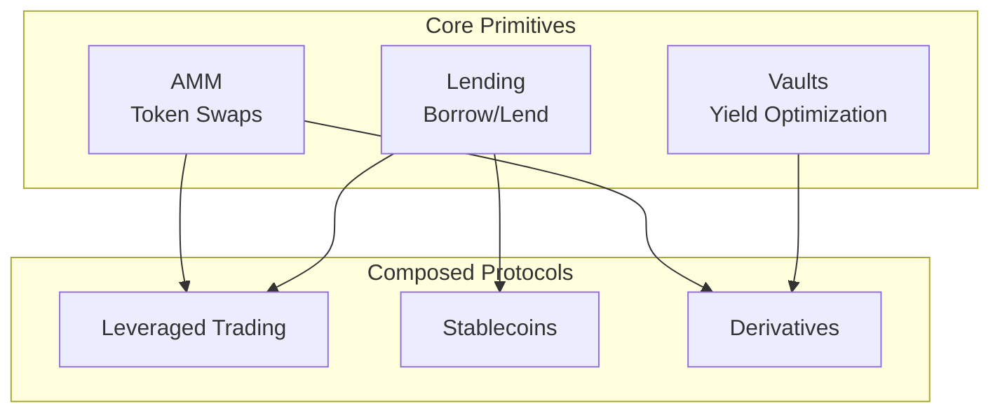
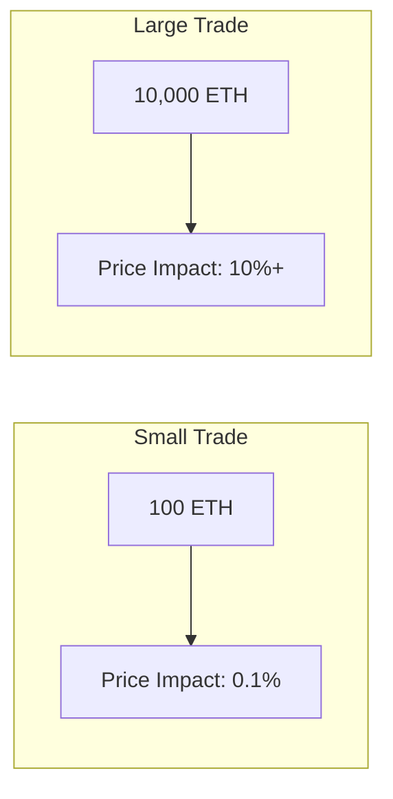
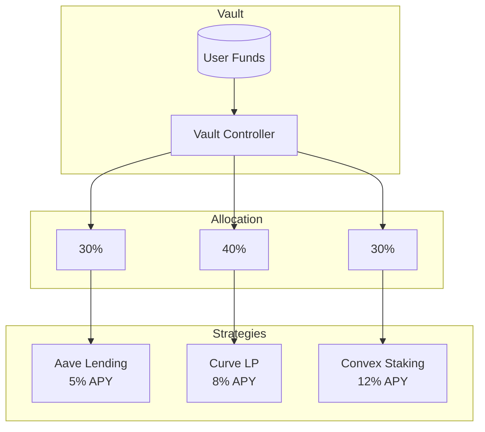

DeFi protocols are financial primitives implemented as smart contracts. This article covers the engineering behind three core DeFi building blocks: Automated Market Makers (AMMs), lending protocols, and yield vaults.

## Understanding DeFi Primitives



## Part 1: Automated Market Makers

Traditional order books match buyers and sellers. AMMs replace this with mathematical formulas and liquidity pools.

### Constant Product Formula (Uniswap V2)

The core invariant: `x * y = k`

```solidity
// Simplified Uniswap V2 Pool
contract ConstantProductAMM {
    IERC20 public immutable token0;
    IERC20 public immutable token1;

    uint256 public reserve0;
    uint256 public reserve1;

    uint256 public totalSupply;
    mapping(address => uint256) public balanceOf;

    uint256 private constant FEE = 3; // 0.3%

    constructor(address _token0, address _token1) {
        token0 = IERC20(_token0);
        token1 = IERC20(_token1);
    }

    function swap(address tokenIn, uint256 amountIn) external returns (uint256 amountOut) {
        require(tokenIn == address(token0) || tokenIn == address(token1), "Invalid token");

        bool isToken0 = tokenIn == address(token0);
        (IERC20 tokenInContract, IERC20 tokenOutContract, uint256 reserveIn, uint256 reserveOut) =
            isToken0
                ? (token0, token1, reserve0, reserve1)
                : (token1, token0, reserve1, reserve0);

        // Transfer tokens in
        tokenInContract.transferFrom(msg.sender, address(this), amountIn);

        // Calculate output with fee
        // amountOut = (reserveOut * amountIn * 997) / (reserveIn * 1000 + amountIn * 997)
        uint256 amountInWithFee = amountIn * (1000 - FEE);
        amountOut = (reserveOut * amountInWithFee) / (reserveIn * 1000 + amountInWithFee);

        // Transfer tokens out
        tokenOutContract.transfer(msg.sender, amountOut);

        // Update reserves
        _updateReserves();
    }

    function addLiquidity(uint256 amount0, uint256 amount1) external returns (uint256 liquidity) {
        token0.transferFrom(msg.sender, address(this), amount0);
        token1.transferFrom(msg.sender, address(this), amount1);

        if (totalSupply == 0) {
            liquidity = sqrt(amount0 * amount1);
        } else {
            liquidity = min(
                (amount0 * totalSupply) / reserve0,
                (amount1 * totalSupply) / reserve1
            );
        }

        require(liquidity > 0, "Insufficient liquidity minted");
        _mint(msg.sender, liquidity);
        _updateReserves();
    }

    function removeLiquidity(uint256 liquidity) external returns (uint256 amount0, uint256 amount1) {
        uint256 balance0 = token0.balanceOf(address(this));
        uint256 balance1 = token1.balanceOf(address(this));

        amount0 = (liquidity * balance0) / totalSupply;
        amount1 = (liquidity * balance1) / totalSupply;

        require(amount0 > 0 && amount1 > 0, "Insufficient liquidity burned");

        _burn(msg.sender, liquidity);
        token0.transfer(msg.sender, amount0);
        token1.transfer(msg.sender, amount1);
        _updateReserves();
    }

    function _updateReserves() private {
        reserve0 = token0.balanceOf(address(this));
        reserve1 = token1.balanceOf(address(this));
    }

    function _mint(address to, uint256 amount) private {
        balanceOf[to] += amount;
        totalSupply += amount;
    }

    function _burn(address from, uint256 amount) private {
        balanceOf[from] -= amount;
        totalSupply -= amount;
    }

    function sqrt(uint256 x) private pure returns (uint256) {
        if (x == 0) return 0;
        uint256 z = (x + 1) / 2;
        uint256 y = x;
        while (z < y) {
            y = z;
            z = (x / z + z) / 2;
        }
        return y;
    }

    function min(uint256 a, uint256 b) private pure returns (uint256) {
        return a < b ? a : b;
    }
}
```

### Price Impact and Slippage



The constant product formula creates price impact proportional to trade size:

```typescript
function calculatePriceImpact(
  amountIn: bigint,
  reserveIn: bigint,
  reserveOut: bigint
): number {
  // Spot price before trade
  const spotPrice = Number(reserveOut) / Number(reserveIn);

  // Execution price with trade
  const amountOut = (reserveOut * amountIn) / (reserveIn + amountIn);
  const executionPrice = Number(amountOut) / Number(amountIn);

  // Price impact as percentage
  return ((spotPrice - executionPrice) / spotPrice) * 100;
}
```

### Concentrated Liquidity (Uniswap V3)

V3 allows LPs to concentrate liquidity in specific price ranges:

```solidity
// Simplified Uniswap V3 position
struct Position {
    int24 tickLower;      // Lower bound of price range
    int24 tickUpper;      // Upper bound of price range
    uint128 liquidity;    // Liquidity in this range
    uint256 feeGrowthInside0;
    uint256 feeGrowthInside1;
}

// Capital efficiency improvement
// V2: Liquidity spread 0 to ∞
// V3: Liquidity in [tickLower, tickUpper]
// Result: Up to 4000x capital efficiency for tight ranges
```

## Part 2: Lending Protocols

Lending protocols enable over-collateralized borrowing against deposited assets.

### Core Lending Logic

```solidity
// Simplified Compound-style lending
contract LendingPool {
    struct Market {
        IERC20 underlying;
        uint256 totalSupply;
        uint256 totalBorrows;
        uint256 reserveFactor;
        uint256 collateralFactor; // e.g., 75% = can borrow 75% of collateral value
        uint256 borrowIndex;
        uint256 lastAccrualBlock;
    }

    struct UserAccount {
        uint256 supplied;
        uint256 borrowed;
        uint256 borrowIndex;
    }

    mapping(address => Market) public markets;
    mapping(address => mapping(address => UserAccount)) public accounts;

    IOracle public oracle;

    // Supply assets to earn interest
    function supply(address asset, uint256 amount) external {
        accrueInterest(asset);
        Market storage market = markets[asset];
        UserAccount storage account = accounts[asset][msg.sender];

        market.underlying.transferFrom(msg.sender, address(this), amount);

        // Convert to "cTokens" (share tokens)
        uint256 exchangeRate = getExchangeRate(asset);
        uint256 cTokens = (amount * 1e18) / exchangeRate;

        account.supplied += cTokens;
        market.totalSupply += cTokens;
    }

    // Borrow against collateral
    function borrow(address asset, uint256 amount) external {
        accrueInterest(asset);
        Market storage market = markets[asset];
        UserAccount storage account = accounts[asset][msg.sender];

        // Check if user has enough collateral
        require(getAccountLiquidity(msg.sender) >= amount, "Insufficient collateral");

        account.borrowed += amount;
        account.borrowIndex = market.borrowIndex;
        market.totalBorrows += amount;

        market.underlying.transfer(msg.sender, amount);
    }

    // Calculate borrowable amount
    function getAccountLiquidity(address user) public view returns (uint256) {
        uint256 totalCollateralValue = 0;
        uint256 totalBorrowValue = 0;

        // Sum across all markets
        address[] memory allMarkets = getMarkets();
        for (uint256 i = 0; i < allMarkets.length; i++) {
            address asset = allMarkets[i];
            Market storage market = markets[asset];
            UserAccount storage account = accounts[asset][user];

            uint256 price = oracle.getPrice(asset);

            // Collateral value (discounted by collateral factor)
            uint256 supplyValue = (account.supplied * getExchangeRate(asset) * price) / 1e36;
            totalCollateralValue += (supplyValue * market.collateralFactor) / 1e18;

            // Borrow value
            totalBorrowValue += (account.borrowed * price) / 1e18;
        }

        if (totalCollateralValue > totalBorrowValue) {
            return totalCollateralValue - totalBorrowValue;
        }
        return 0;
    }

    // Interest accrual
    function accrueInterest(address asset) public {
        Market storage market = markets[asset];

        uint256 blockDelta = block.number - market.lastAccrualBlock;
        if (blockDelta == 0) return;

        uint256 borrowRate = getBorrowRate(asset);
        uint256 interestFactor = borrowRate * blockDelta;

        uint256 interestAccumulated = (market.totalBorrows * interestFactor) / 1e18;
        market.totalBorrows += interestAccumulated;
        market.borrowIndex += (interestFactor * market.borrowIndex) / 1e18;
        market.lastAccrualBlock = block.number;
    }

    // Interest rate model (utilization-based)
    function getBorrowRate(address asset) public view returns (uint256) {
        Market storage market = markets[asset];

        if (market.totalSupply == 0) return 0;

        uint256 utilization = (market.totalBorrows * 1e18) / market.totalSupply;

        // Kink model: low rate below 80% utilization, high rate above
        uint256 kink = 0.8e18;
        uint256 baseRate = 0.02e18;  // 2%
        uint256 multiplier = 0.1e18; // 10%
        uint256 jumpMultiplier = 1e18; // 100%

        if (utilization <= kink) {
            return baseRate + (utilization * multiplier) / 1e18;
        } else {
            uint256 normalRate = baseRate + (kink * multiplier) / 1e18;
            uint256 excessUtil = utilization - kink;
            return normalRate + (excessUtil * jumpMultiplier) / 1e18;
        }
    }

    function getExchangeRate(address asset) public view returns (uint256) {
        Market storage market = markets[asset];
        if (market.totalSupply == 0) return 1e18;

        uint256 totalCash = market.underlying.balanceOf(address(this));
        return ((totalCash + market.totalBorrows) * 1e18) / market.totalSupply;
    }
}
```

### Liquidations

When collateral falls below threshold, positions can be liquidated:

```solidity
function liquidate(
    address borrower,
    address repayAsset,
    address seizeAsset,
    uint256 repayAmount
) external {
    // Check borrower is liquidatable
    require(getAccountLiquidity(borrower) == 0, "Account not liquidatable");

    // Calculate seized collateral (with bonus for liquidator)
    uint256 liquidationBonus = 1.08e18; // 8% bonus
    uint256 repayValue = (repayAmount * oracle.getPrice(repayAsset)) / 1e18;
    uint256 seizeAmount = (repayValue * liquidationBonus) / oracle.getPrice(seizeAsset);

    // Repay debt
    IERC20(repayAsset).transferFrom(msg.sender, address(this), repayAmount);
    accounts[repayAsset][borrower].borrowed -= repayAmount;

    // Seize collateral
    accounts[seizeAsset][borrower].supplied -= seizeAmount;
    accounts[seizeAsset][msg.sender].supplied += seizeAmount;
}
```

## Part 3: Yield Vaults

Vaults automate yield strategies across DeFi protocols.

### ERC-4626 Tokenized Vault

```solidity
// ERC-4626 compliant yield vault
import "@openzeppelin/contracts/token/ERC20/extensions/ERC4626.sol";

contract YieldVault is ERC4626 {
    ILendingPool public lendingPool;
    IERC20 public rewardToken;

    uint256 public lastHarvest;
    uint256 public performanceFee = 1000; // 10%

    constructor(
        IERC20 _asset,
        address _lendingPool,
        address _rewardToken
    ) ERC4626(_asset) ERC20("Yield Vault Token", "yvTKN") {
        lendingPool = ILendingPool(_lendingPool);
        rewardToken = IERC20(_rewardToken);
    }

    // Deposit and deploy to strategy
    function afterDeposit(uint256 assets, uint256 shares) internal override {
        // Deploy to lending pool
        IERC20(asset()).approve(address(lendingPool), assets);
        lendingPool.supply(address(asset()), assets);
    }

    // Withdraw from strategy
    function beforeWithdraw(uint256 assets, uint256 shares) internal override {
        lendingPool.withdraw(address(asset()), assets);
    }

    // Harvest rewards and compound
    function harvest() external {
        // Claim rewards
        uint256 rewards = lendingPool.claimRewards(address(this));

        if (rewards > 0) {
            // Swap rewards for underlying
            uint256 assetsReceived = _swapRewardsForAsset(rewards);

            // Take performance fee
            uint256 fee = (assetsReceived * performanceFee) / 10000;
            IERC20(asset()).transfer(treasury, fee);

            // Compound remainder
            uint256 toCompound = assetsReceived - fee;
            IERC20(asset()).approve(address(lendingPool), toCompound);
            lendingPool.supply(address(asset()), toCompound);
        }

        lastHarvest = block.timestamp;
    }

    // Total assets = deposited + earned
    function totalAssets() public view override returns (uint256) {
        return lendingPool.balanceOf(address(this));
    }
}
```

### Multi-Strategy Vault



```solidity
contract MultiStrategyVault is ERC4626 {
    struct Strategy {
        address adapter;
        uint256 allocation; // Basis points (100 = 1%)
        bool active;
    }

    Strategy[] public strategies;
    uint256 public constant TOTAL_ALLOCATION = 10000;

    function addStrategy(address adapter, uint256 allocation) external onlyOwner {
        strategies.push(Strategy({
            adapter: adapter,
            allocation: allocation,
            active: true
        }));
        rebalance();
    }

    function rebalance() public {
        uint256 total = totalAssets();

        for (uint256 i = 0; i < strategies.length; i++) {
            if (!strategies[i].active) continue;

            IStrategyAdapter adapter = IStrategyAdapter(strategies[i].adapter);
            uint256 targetAmount = (total * strategies[i].allocation) / TOTAL_ALLOCATION;
            uint256 currentAmount = adapter.balanceOf(address(this));

            if (targetAmount > currentAmount) {
                // Deploy more
                uint256 toDeposit = targetAmount - currentAmount;
                IERC20(asset()).approve(strategies[i].adapter, toDeposit);
                adapter.deposit(toDeposit);
            } else if (currentAmount > targetAmount) {
                // Withdraw excess
                uint256 toWithdraw = currentAmount - targetAmount;
                adapter.withdraw(toWithdraw);
            }
        }
    }
}
```

## Gas Optimization for DeFi

DeFi transactions are often expensive. Key optimizations:

### 1. Batch Operations

```solidity
// Bad: Multiple transactions
function deposit() external;
function stake() external;
function claim() external;

// Good: Single transaction
function depositStakeAndClaim(uint256 amount) external {
    deposit(amount);
    stake(depositedAmount);
    claim();
}
```

### 2. Minimal Proxy (EIP-1167)

```solidity
// Deploy cheap clones of expensive contracts
import "@openzeppelin/contracts/proxy/Clones.sol";

function createVault() external returns (address) {
    address clone = Clones.clone(vaultImplementation);
    IVault(clone).initialize(msg.sender);
    return clone;
}
```

### 3. Storage Packing

```solidity
// Bad: 3 storage slots
struct Position {
    uint256 amount;      // Slot 0
    uint256 timestamp;   // Slot 1
    address owner;       // Slot 2
}

// Good: 2 storage slots
struct Position {
    uint128 amount;      // Slot 0 (16 bytes)
    uint64 timestamp;    // Slot 0 (8 bytes)
    address owner;       // Slot 0 (20 bytes) - wait, overflow!
    // Actually: Slot 0 has 24 bytes, owner goes to Slot 1
}

// Better: 1 storage slot (if values fit)
struct Position {
    uint96 amount;       // 12 bytes
    uint64 timestamp;    // 8 bytes
    // Pack owner separately or use msg.sender
}
```

## Testing DeFi Protocols

### Fork Testing

```solidity
// Test against real mainnet state
function testForkSwap() public {
    // Fork mainnet at specific block
    vm.createSelectFork(vm.envString("RPC_URL"), 18500000);

    // Get real Uniswap router
    IUniswapV2Router router = IUniswapV2Router(UNISWAP_ROUTER);

    // Get real tokens
    IERC20 weth = IERC20(WETH);
    IERC20 usdc = IERC20(USDC);

    // Deal tokens to test address
    deal(address(weth), address(this), 10 ether);

    // Execute real swap
    weth.approve(address(router), 10 ether);
    uint256[] memory amounts = router.swapExactTokensForTokens(
        10 ether,
        0,
        [address(weth), address(usdc)],
        address(this),
        block.timestamp
    );

    assertGt(amounts[1], 0);
}
```

### Invariant Testing

```solidity
contract AMMInvariantTest is Test {
    ConstantProductAMM amm;

    function setUp() public {
        amm = new ConstantProductAMM(address(token0), address(token1));
        // Add initial liquidity
    }

    // This invariant should ALWAYS hold
    function invariant_constantProduct() public {
        uint256 k = amm.reserve0() * amm.reserve1();
        assertGe(k, initialK, "Constant product violated");
    }

    function invariant_reservesMatchBalance() public {
        assertEq(amm.reserve0(), token0.balanceOf(address(amm)));
        assertEq(amm.reserve1(), token1.balanceOf(address(amm)));
    }
}
```

## Deployment Considerations

1. **Timelock all admin functions** - 24-48 hour delay minimum
2. **Multi-sig ownership** - Gnosis Safe with 3/5 or higher
3. **Gradual rollout** - Start with caps, increase over time
4. **Bug bounty** - Immunefi or similar, proportional to TVL
5. **Insurance** - Consider Nexus Mutual or similar

DeFi protocol engineering is complex but rewarding. Start with simple primitives, test exhaustively, and always prioritize security over speed.

## References

- [Uniswap V2 Whitepaper](https://uniswap.org/whitepaper.pdf)
- [Compound Protocol Specification](https://compound.finance/documents/Compound.Whitepaper.pdf)
- [ERC-4626 Tokenized Vault Standard](https://eips.ethereum.org/EIPS/eip-4626)
- [Yearn Vault Architecture](https://docs.yearn.finance/)
