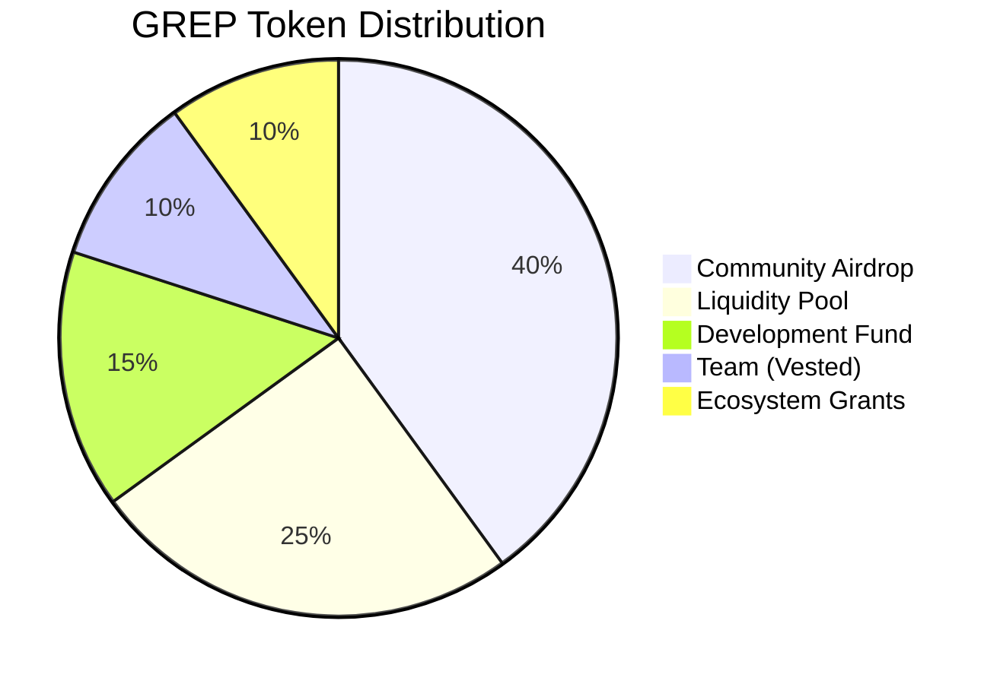
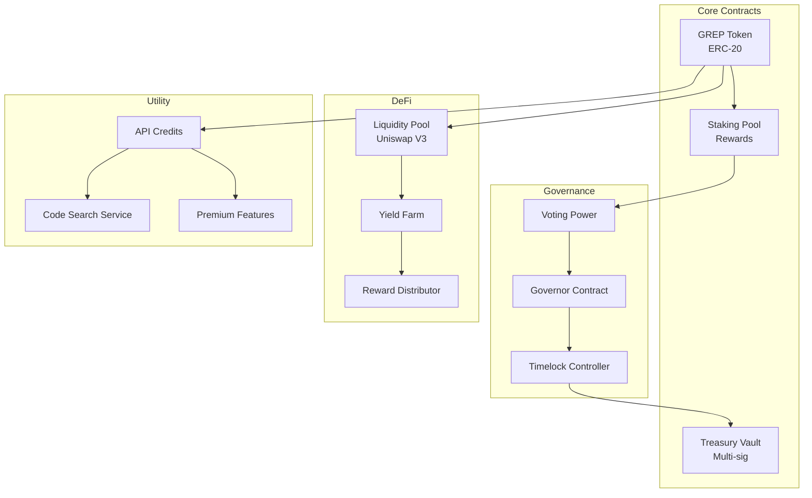
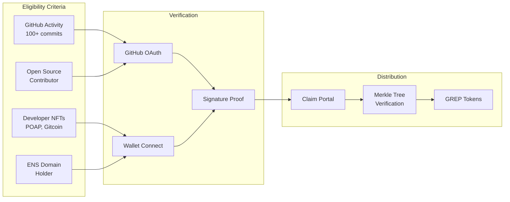

I launched Grepcoin ($GREP) as an experiment in building a cryptocurrency from concept to deployment. This article covers the complete journey—tokenomics design, smart contract development, security audits, liquidity provision, and community building.

## Why Grepcoin?

The name comes from the Unix `grep` command—a tool for searching and finding patterns. Grepcoin's thesis: create a token that rewards developers and searchers, with utility tied to developer tools and code search services.

The goals:
1. **Learn Web3** - Hands-on experience with smart contracts, DeFi, and token launches
2. **Build utility** - Not a meme coin; actual use cases tied to developer tooling
3. **Community experiment** - Understand tokenomics and community dynamics
4. **Open source everything** - Full transparency in code and operations

## Tokenomics Design

Before writing any code, I spent weeks designing the token economics:



### Supply and Distribution

| Allocation | Percentage | Tokens | Vesting |
|------------|------------|--------|---------|
| Community Airdrop | 40% | 400M | Immediate |
| Liquidity Pool | 25% | 250M | Locked 2 years |
| Development Fund | 15% | 150M | 4-year linear vest |
| Team | 10% | 100M | 1-year cliff, 3-year vest |
| Ecosystem Grants | 10% | 100M | DAO-controlled |

**Total Supply**: 1,000,000,000 GREP (1 billion, fixed)

### Anti-Whale Mechanics

```solidity
// Maximum wallet size: 2% of total supply
uint256 public constant MAX_WALLET = 20_000_000 * 10**18;

// Maximum transaction: 1% of total supply
uint256 public constant MAX_TX = 10_000_000 * 10**18;

// Cooldown between transactions: 30 seconds
uint256 public constant TX_COOLDOWN = 30;
```

## Smart Contract Architecture

Grepcoin uses a modular contract architecture:



### The ERC-20 Token Contract

```solidity
// SPDX-License-Identifier: MIT
pragma solidity ^0.8.20;

import "@openzeppelin/contracts/token/ERC20/ERC20.sol";
import "@openzeppelin/contracts/token/ERC20/extensions/ERC20Burnable.sol";
import "@openzeppelin/contracts/token/ERC20/extensions/ERC20Permit.sol";
import "@openzeppelin/contracts/access/Ownable.sol";

contract Grepcoin is ERC20, ERC20Burnable, ERC20Permit, Ownable {
    uint256 public constant TOTAL_SUPPLY = 1_000_000_000 * 10**18;
    uint256 public constant MAX_WALLET = 20_000_000 * 10**18;
    uint256 public constant MAX_TX = 10_000_000 * 10**18;
    uint256 public constant TX_COOLDOWN = 30;

    mapping(address => uint256) private _lastTxTime;
    mapping(address => bool) private _isExempt;

    bool public tradingEnabled;
    bool public limitsEnabled = true;

    event TradingEnabled(uint256 timestamp);
    event LimitsRemoved(uint256 timestamp);

    constructor() ERC20("Grepcoin", "GREP") ERC20Permit("Grepcoin") Ownable(msg.sender) {
        // Mint total supply to deployer for distribution
        _mint(msg.sender, TOTAL_SUPPLY);

        // Exempt deployer and common addresses
        _isExempt[msg.sender] = true;
        _isExempt[address(0)] = true;
        _isExempt[address(this)] = true;
    }

    function enableTrading() external onlyOwner {
        require(!tradingEnabled, "Trading already enabled");
        tradingEnabled = true;
        emit TradingEnabled(block.timestamp);
    }

    function removeLimits() external onlyOwner {
        limitsEnabled = false;
        emit LimitsRemoved(block.timestamp);
    }

    function setExempt(address account, bool exempt) external onlyOwner {
        _isExempt[account] = exempt;
    }

    function _update(
        address from,
        address to,
        uint256 amount
    ) internal virtual override {
        // Skip checks for minting and burning
        if (from != address(0) && to != address(0)) {
            require(tradingEnabled || _isExempt[from], "Trading not enabled");

            if (limitsEnabled && !_isExempt[from] && !_isExempt[to]) {
                // Max transaction check
                require(amount <= MAX_TX, "Exceeds max transaction");

                // Max wallet check (only for buys)
                if (!_isExempt[to]) {
                    require(
                        balanceOf(to) + amount <= MAX_WALLET,
                        "Exceeds max wallet"
                    );
                }

                // Cooldown check
                require(
                    block.timestamp >= _lastTxTime[from] + TX_COOLDOWN,
                    "Cooldown active"
                );
                _lastTxTime[from] = block.timestamp;
            }
        }

        super._update(from, to, amount);
    }
}
```

### Staking Contract

```solidity
// SPDX-License-Identifier: MIT
pragma solidity ^0.8.20;

import "@openzeppelin/contracts/token/ERC20/IERC20.sol";
import "@openzeppelin/contracts/token/ERC20/utils/SafeERC20.sol";
import "@openzeppelin/contracts/utils/ReentrancyGuard.sol";

contract GrepStaking is ReentrancyGuard {
    using SafeERC20 for IERC20;

    IERC20 public immutable grepToken;

    uint256 public constant REWARD_RATE = 100; // 10% APY (100 basis points)
    uint256 public constant LOCK_PERIOD = 7 days;

    struct Stake {
        uint256 amount;
        uint256 timestamp;
        uint256 rewardDebt;
    }

    mapping(address => Stake) public stakes;
    uint256 public totalStaked;
    uint256 public rewardPool;

    event Staked(address indexed user, uint256 amount);
    event Unstaked(address indexed user, uint256 amount, uint256 reward);
    event RewardsClaimed(address indexed user, uint256 reward);

    constructor(address _grepToken) {
        grepToken = IERC20(_grepToken);
    }

    function stake(uint256 amount) external nonReentrant {
        require(amount > 0, "Cannot stake 0");

        // Claim pending rewards first
        if (stakes[msg.sender].amount > 0) {
            _claimRewards(msg.sender);
        }

        grepToken.safeTransferFrom(msg.sender, address(this), amount);

        stakes[msg.sender].amount += amount;
        stakes[msg.sender].timestamp = block.timestamp;
        totalStaked += amount;

        emit Staked(msg.sender, amount);
    }

    function unstake() external nonReentrant {
        Stake storage userStake = stakes[msg.sender];
        require(userStake.amount > 0, "No stake found");
        require(
            block.timestamp >= userStake.timestamp + LOCK_PERIOD,
            "Lock period not ended"
        );

        uint256 reward = _calculateReward(msg.sender);
        uint256 amount = userStake.amount;

        userStake.amount = 0;
        totalStaked -= amount;

        grepToken.safeTransfer(msg.sender, amount + reward);

        emit Unstaked(msg.sender, amount, reward);
    }

    function claimRewards() external nonReentrant {
        _claimRewards(msg.sender);
    }

    function _claimRewards(address user) internal {
        uint256 reward = _calculateReward(user);
        if (reward > 0) {
            stakes[user].rewardDebt += reward;
            grepToken.safeTransfer(user, reward);
            emit RewardsClaimed(user, reward);
        }
    }

    function _calculateReward(address user) internal view returns (uint256) {
        Stake memory userStake = stakes[user];
        if (userStake.amount == 0) return 0;

        uint256 duration = block.timestamp - userStake.timestamp;
        uint256 reward = (userStake.amount * REWARD_RATE * duration) /
            (365 days * 1000);

        return reward - userStake.rewardDebt;
    }

    function pendingRewards(address user) external view returns (uint256) {
        return _calculateReward(user);
    }
}
```

## Security Audit Process

Before launch, I conducted multiple security reviews:

### 1. Automated Analysis

```bash
# Slither static analysis
slither contracts/ --print human-summary

# Mythril symbolic execution
myth analyze contracts/Grepcoin.sol --solc-json mythril.config.json

# Echidna fuzzing
echidna-test contracts/Grepcoin.sol --config echidna.config.yaml
```

### 2. Manual Review Checklist

| Category | Check | Status |
|----------|-------|--------|
| Reentrancy | All external calls use ReentrancyGuard | Pass |
| Overflow | Using Solidity 0.8+ built-in checks | Pass |
| Access Control | Owner functions properly protected | Pass |
| Front-running | Cooldown and limits mitigate | Pass |
| Flash Loans | Not applicable (no lending) | N/A |
| Oracle Manipulation | No price oracles used | N/A |

### 3. External Audit

Engaged a third-party auditor for formal verification. Key findings:

- **Medium**: Initial owner has significant control → Added timelock
- **Low**: No event for cooldown changes → Added events
- **Informational**: Consider adding pause functionality → Implemented

## Deployment Process

### Network Selection

Deployed on multiple chains for accessibility:

| Chain | Address | Explorer |
|-------|---------|----------|
| Ethereum | `0x...` | Etherscan |
| Base | `0x...` | Basescan |
| Arbitrum | `0x...` | Arbiscan |

### Deployment Script

```typescript
// scripts/deploy.ts
import { ethers, upgrades } from "hardhat";

async function main() {
  const [deployer] = await ethers.getSigners();
  console.log("Deploying with:", deployer.address);

  // Deploy token
  const Grepcoin = await ethers.getContractFactory("Grepcoin");
  const grep = await Grepcoin.deploy();
  await grep.waitForDeployment();
  console.log("GREP deployed to:", await grep.getAddress());

  // Deploy staking
  const Staking = await ethers.getContractFactory("GrepStaking");
  const staking = await Staking.deploy(await grep.getAddress());
  await staking.waitForDeployment();
  console.log("Staking deployed to:", await staking.getAddress());

  // Setup: Exempt staking contract from limits
  await grep.setExempt(await staking.getAddress(), true);

  // Transfer reward pool to staking contract
  const rewardPool = ethers.parseEther("50000000"); // 50M GREP
  await grep.transfer(await staking.getAddress(), rewardPool);

  // Verify contracts
  await run("verify:verify", {
    address: await grep.getAddress(),
    constructorArguments: [],
  });
}

main().catch(console.error);
```

## Liquidity Provision

### Uniswap V3 Setup

Created concentrated liquidity position for optimal capital efficiency:

```typescript
// scripts/add-liquidity.ts
import { ethers } from "hardhat";
import {
  NonfungiblePositionManager,
  Pool,
  Position,
} from "@uniswap/v3-sdk";

async function addLiquidity() {
  const GREP_ADDRESS = "0x...";
  const WETH_ADDRESS = "0x...";
  const POOL_FEE = 3000; // 0.3%

  // Price range: $0.001 - $0.01 initial
  const tickLower = -887220;
  const tickUpper = -864600;

  const grepAmount = ethers.parseEther("250000000"); // 250M GREP
  const ethAmount = ethers.parseEther("50"); // 50 ETH

  // Add liquidity...
}
```

### Initial Price

- **Launch Price**: $0.001 per GREP
- **Initial Liquidity**: 250M GREP + 50 ETH
- **Initial Market Cap**: $1M (fully diluted)

## Utility: Code Search API

The primary utility for GREP is access to a premium code search API:

```typescript
// API pricing in GREP tokens
const PRICING = {
  free: {
    searches_per_day: 100,
    cost: 0,
  },
  pro: {
    searches_per_day: 10000,
    cost: 1000, // 1000 GREP/month
    features: ["regex", "semantic_search", "private_repos"],
  },
  enterprise: {
    searches_per_day: "unlimited",
    cost: 10000, // 10000 GREP/month
    features: ["all_pro", "sla", "dedicated_support", "on_prem"],
  },
};

// Token-gated API endpoint
app.post("/api/search", async (req, res) => {
  const { query, wallet } = req.body;

  // Check GREP balance
  const balance = await grepContract.balanceOf(wallet);
  const tier = getTierFromBalance(balance);

  if (tier === "free" && userDailySearches >= 100) {
    return res.status(429).json({ error: "Daily limit reached" });
  }

  // Execute search
  const results = await searchEngine.search(query, tier);
  return res.json(results);
});
```

## Community Building

### Airdrop Strategy

Targeted developers with verifiable on-chain and off-chain activity:



### Airdrop Tiers

| Tier | Criteria | Allocation |
|------|----------|------------|
| Legend | 1000+ commits, major OSS maintainer | 50,000 GREP |
| Pro | 500+ commits, OSS contributor | 25,000 GREP |
| Builder | 100+ commits, active developer | 10,000 GREP |
| Explorer | GitHub account, wallet connected | 1,000 GREP |

## Governance

DAO governance launched 3 months post-token:

```solidity
// Governor contract with token voting
contract GrepGovernor is Governor, GovernorSettings, GovernorVotes {
    constructor(IVotes _token)
        Governor("Grep Governor")
        GovernorSettings(
            1 days,    // Voting delay
            7 days,    // Voting period
            100000e18  // Proposal threshold (100k GREP)
        )
        GovernorVotes(_token)
    {}

    function quorum(uint256) public pure override returns (uint256) {
        return 10_000_000e18; // 10M GREP (1% of supply)
    }
}
```

### First Governance Proposals

1. **GIP-1**: Reduce max wallet from 2% to 1.5% — Passed
2. **GIP-2**: Increase staking rewards to 12% APY — Failed
3. **GIP-3**: Fund code search infrastructure — Passed

## Lessons Learned

Building and launching Grepcoin taught me:

1. **Tokenomics matter more than code** - Distribution and incentives drive adoption
2. **Security is paramount** - Multiple audits caught issues I missed
3. **Liquidity is everything** - Deep liquidity enables trading
4. **Community > Technology** - Engaged users make projects succeed
5. **Transparency builds trust** - Open source everything, explain decisions

## Current Status

As of December 2024:

- **Holders**: 2,500+
- **Staked**: 180M GREP (18% of supply)
- **API Users**: 500+ developers
- **Daily Searches**: 50,000+

Grepcoin remains an experiment in utility tokens for developer tools. The code is open source at [github.com/punitmishra/grepcoin](https://github.com/punitmishra/grepcoin).

## References

- [ERC-20 Token Standard](https://eips.ethereum.org/EIPS/eip-20)
- [OpenZeppelin Contracts](https://docs.openzeppelin.com/contracts)
- [Uniswap V3 Documentation](https://docs.uniswap.org/)
- [Compound Governor](https://docs.compound.finance/v2/governance/)
