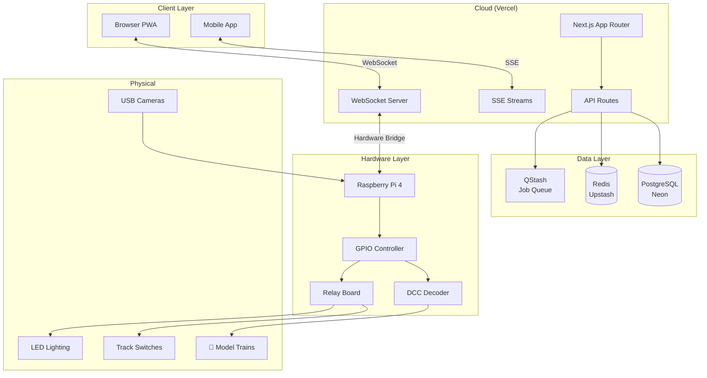
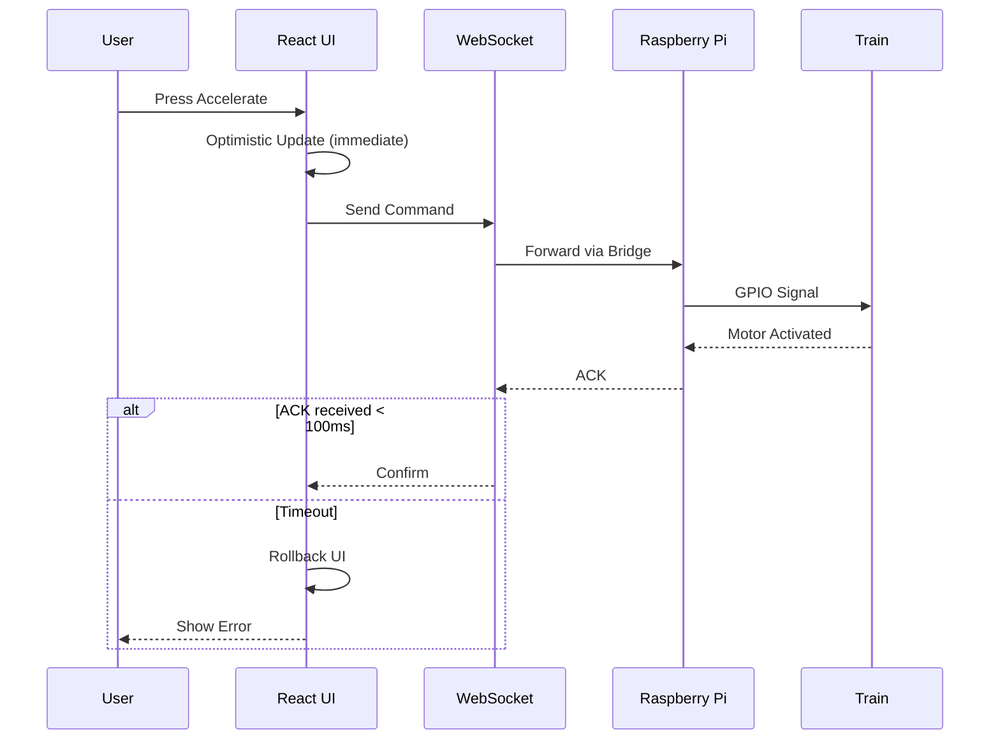
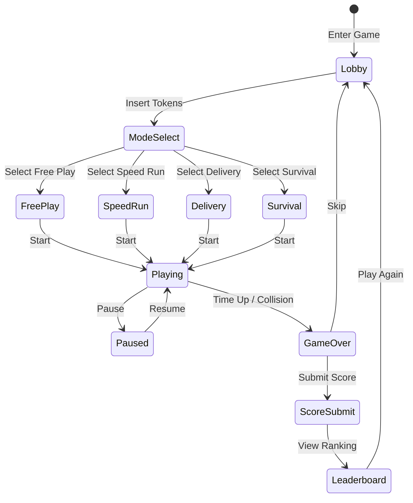

What started as a childhood hobby became a full-stack engineering challenge: building a web application that lets anyone in the world control a real, physical model railroad in real-time. Railroad Arcade combines Next.js, WebSockets, Raspberry Pi GPIO control, and a gamification system into a unique IoT experience.

## The Vision

I have a 2-level HO scale model railroad. It sits in my office, running in circles. I wanted to share it with the world—not through videos, but through actual control. Real trains, real switches, real lights, controlled by anyone with a browser.

The technical challenges were fascinating:

- **Real-time control** - Sub-100ms latency from button press to train movement
- **Hardware abstraction** - Same UI works in demo mode and live mode
- **Multi-user coordination** - Multiple viewers, one controller at a time
- **Gamification** - Achievements, leaderboards, tournaments to keep users engaged

## Architecture Overview



```asciinema
https://asciinema.org/a/demo-railroad-setup
Setting Up Railroad Arcade Development Environment
```

## Real-Time Train Control

The core challenge is latency. When a user presses "accelerate," the train should respond immediately—not in 500ms.



```typescript
// hooks/useHardwareControl.ts
export const useHardwareControl = () => {
  const [mode, setMode] = useState<'demo' | 'live'>('demo');
  const wsRef = useRef<WebSocket | null>(null);
  const commandQueue = useRef<Command[]>([]);

  // Optimistic updates with rollback
  const sendCommand = useCallback(async (command: TrainCommand) => {
    // 1. Apply optimistically to UI immediately
    applyOptimistic(command);

    // 2. Queue for hardware
    commandQueue.current.push({
      ...command,
      timestamp: Date.now(),
      id: crypto.randomUUID(),
    });

    // 3. Send via WebSocket
    if (wsRef.current?.readyState === WebSocket.OPEN) {
      wsRef.current.send(JSON.stringify(command));
    }

    // 4. Rollback on failure
    try {
      await waitForAck(command.id, 100); // 100ms timeout
    } catch {
      rollbackOptimistic(command);
      toast.error('Command failed - please retry');
    }
  }, [mode]);

  return { sendCommand, mode, setMode };
};
```

### Hardware Bridge (Raspberry Pi)

The Pi runs a Python service that translates WebSocket commands to GPIO signals:

```python
# hardware_bridge.py
import asyncio
from gpiozero import PWMOutputDevice, DigitalOutputDevice
import websockets

class TrainController:
    def __init__(self):
        # PWM for variable speed control
        self.motors = {
            'train_1': PWMOutputDevice(18, frequency=1000),
            'train_2': PWMOutputDevice(19, frequency=1000),
            'train_3': PWMOutputDevice(20, frequency=1000),
        }

        # Digital for switches and lights
        self.switches = {
            'junction_a': DigitalOutputDevice(21),
            'junction_b': DigitalOutputDevice(22),
            'crossing': DigitalOutputDevice(23),
        }

    async def handle_command(self, command: dict):
        cmd_type = command['type']

        if cmd_type == 'speed':
            train = self.motors[command['train_id']]
            # Smooth acceleration
            current = train.value
            target = command['speed'] / 100  # 0-100 to 0-1
            await self.smooth_transition(train, current, target)

        elif cmd_type == 'switch':
            switch = self.switches[command['switch_id']]
            switch.value = command['position']

        elif cmd_type == 'emergency_stop':
            for motor in self.motors.values():
                motor.value = 0

    async def smooth_transition(self, device, start, end, duration=0.3):
        steps = 20
        for i in range(steps + 1):
            device.value = start + (end - start) * (i / steps)
            await asyncio.sleep(duration / steps)

async def main():
    controller = TrainController()

    async with websockets.serve(
        lambda ws, path: handler(ws, controller),
        "0.0.0.0", 8765
    ):
        await asyncio.Future()  # Run forever
```

## Live SVG Track Visualization

The frontend renders an interactive SVG that updates in real-time:

```typescript
// components/TrackVisualization.tsx
export const TrackVisualization = () => {
  const { trains, switches, activeZone } = useTrackState();

  return (
    <svg viewBox="0 0 1000 600" className="w-full h-auto">
      {/* Track paths */}
      <g id="tracks">
        <path
          d={TRACK_PATHS.mainLoop}
          stroke="#666"
          strokeWidth="4"
          fill="none"
        />
        <path
          d={TRACK_PATHS.innerLoop}
          stroke="#666"
          strokeWidth="4"
          fill="none"
        />
      </g>

      {/* Animated trains */}
      {trains.map((train) => (
        <g
          key={train.id}
          transform={`translate(${train.x}, ${train.y}) rotate(${train.rotation})`}
        >
          <motion.rect
            width="30"
            height="12"
            fill={train.color}
            rx="2"
            animate={{ x: train.x, y: train.y }}
            transition={{ type: "spring", stiffness: 300, damping: 30 }}
          />
          {/* Headlight */}
          <circle cx="28" cy="6" r="2" fill="#FFD700" />
        </g>
      ))}

      {/* Interactive switches */}
      {Object.entries(switches).map(([id, state]) => (
        <Switch
          key={id}
          id={id}
          position={state}
          onClick={() => toggleSwitch(id)}
        />
      ))}

      {/* Active zone highlighting */}
      {activeZone && (
        <rect
          {...ZONE_BOUNDS[activeZone]}
          fill="rgba(59, 130, 246, 0.2)"
          stroke="#3B82F6"
          strokeWidth="2"
        />
      )}
    </svg>
  );
};
```

## Game Modes and Scoring

To make it engaging, I added arcade-style game modes:



```typescript
// lib/gameEngine.ts
export interface GameMode {
  id: string;
  name: string;
  tokenCost: number;
  duration: number;
  objectives: Objective[];
  scoring: ScoringRules;
}

export const GAME_MODES: GameMode[] = [
  {
    id: 'free_play',
    name: 'Free Play',
    tokenCost: 2,
    duration: 300, // 5 minutes
    objectives: [],
    scoring: { basePoints: 0 },
  },
  {
    id: 'speed_run',
    name: 'Speed Run',
    tokenCost: 5,
    duration: 120,
    objectives: [
      { type: 'complete_laps', target: 5, points: 100 },
    ],
    scoring: {
      basePoints: 50,
      lapBonus: 100,
      timeBonus: (remaining) => remaining * 2,
    },
  },
  {
    id: 'delivery_mission',
    name: 'Delivery Mission',
    tokenCost: 5,
    duration: 180,
    objectives: [
      { type: 'visit_stations', stations: ['A', 'B', 'C', 'D'], points: 50 },
      { type: 'no_collisions', points: 200 },
    ],
    scoring: {
      basePoints: 0,
      stationBonus: 50,
      perfectBonus: 500,
    },
  },
  {
    id: 'survival',
    name: 'Survival',
    tokenCost: 5,
    duration: Infinity,
    objectives: [
      { type: 'avoid_collision', points: 10 }, // Per second survived
    ],
    scoring: {
      basePoints: 0,
      survivalBonus: (seconds) => seconds * 10,
    },
  },
];

// Collision detection
export const checkCollision = (trains: Train[]): boolean => {
  for (let i = 0; i < trains.length; i++) {
    for (let j = i + 1; j < trains.length; j++) {
      const distance = Math.hypot(
        trains[i].x - trains[j].x,
        trains[i].y - trains[j].y
      );
      if (distance < COLLISION_THRESHOLD) {
        return true;
      }
    }
  }
  return false;
};
```

## Multi-Camera System

Users can choose from multiple camera views:

```typescript
// components/CameraGrid.tsx
type ViewMode = 'single' | 'dual' | 'quad' | 'pip';

export const CameraGrid = () => {
  const [viewMode, setViewMode] = useState<ViewMode>('single');
  const [activeCamera, setActiveCamera] = useState(0);

  const cameras = [
    { id: 0, name: 'Overview', url: '/api/camera/0' },
    { id: 1, name: 'Station A', url: '/api/camera/1' },
    { id: 2, name: 'Bridge', url: '/api/camera/2' },
    { id: 3, name: 'Tunnel', url: '/api/camera/3' },
  ];

  const layouts = {
    single: 'grid-cols-1',
    dual: 'grid-cols-2',
    quad: 'grid-cols-2 grid-rows-2',
    pip: 'relative',
  };

  return (
    <div className={`grid ${layouts[viewMode]} gap-2`}>
      {viewMode === 'pip' ? (
        <>
          <CameraFeed camera={cameras[activeCamera]} className="w-full" />
          <div className="absolute bottom-4 right-4 w-1/4">
            <CameraFeed camera={cameras[(activeCamera + 1) % 4]} />
          </div>
        </>
      ) : (
        cameras.slice(0, viewMode === 'single' ? 1 : viewMode === 'dual' ? 2 : 4)
          .map((camera) => (
            <CameraFeed
              key={camera.id}
              camera={camera}
              onClick={() => setActiveCamera(camera.id)}
            />
          ))
      )}
    </div>
  );
};
```

## Environment Control

The railroad has controllable lighting zones and animated elements:

```typescript
// hooks/useEnvironment.ts
export const useEnvironment = () => {
  const [timeOfDay, setTimeOfDay] = useState<TimeOfDay>('day');
  const [zones, setZones] = useState<LightingZone[]>(DEFAULT_ZONES);

  // Preset lighting configurations
  const presets: Record<TimeOfDay, ZoneConfig[]> = {
    dawn: [
      { zone: 'street_lights', brightness: 0.3 },
      { zone: 'buildings', brightness: 0.1 },
      { zone: 'sky', color: '#FFB366' },
    ],
    day: [
      { zone: 'street_lights', brightness: 0 },
      { zone: 'buildings', brightness: 0 },
      { zone: 'sky', color: '#87CEEB' },
    ],
    sunset: [
      { zone: 'street_lights', brightness: 0.5 },
      { zone: 'buildings', brightness: 0.3 },
      { zone: 'sky', color: '#FF6B6B' },
    ],
    night: [
      { zone: 'street_lights', brightness: 1.0 },
      { zone: 'buildings', brightness: 0.8 },
      { zone: 'sky', color: '#1a1a2e' },
      { zone: 'stars', enabled: true },
    ],
  };

  const applyTimeOfDay = async (time: TimeOfDay) => {
    setTimeOfDay(time);
    const config = presets[time];

    // Smooth transition over 2 seconds
    await animateLighting(zones, config, 2000);

    // Send to hardware
    await fetch('/api/environment', {
      method: 'POST',
      body: JSON.stringify({ timeOfDay: time, zones: config }),
    });
  };

  return { timeOfDay, zones, applyTimeOfDay };
};
```

## Leaderboards and Tournaments

PostgreSQL with Prisma handles competitive features:

```typescript
// app/api/leaderboard/route.ts
import { prisma } from '@/lib/prisma';

export async function GET(request: Request) {
  const { searchParams } = new URL(request.url);
  const mode = searchParams.get('mode') || 'speed_run';
  const period = searchParams.get('period') || 'all_time';

  const dateFilter = period === 'daily'
    ? { createdAt: { gte: startOfDay(new Date()) } }
    : period === 'weekly'
    ? { createdAt: { gte: startOfWeek(new Date()) } }
    : {};

  const leaderboard = await prisma.score.findMany({
    where: {
      gameMode: mode,
      ...dateFilter,
    },
    orderBy: { score: 'desc' },
    take: 100,
    include: {
      user: {
        select: { name: true, image: true },
      },
    },
  });

  return Response.json(leaderboard);
}

// Tournament system
export async function createTournament(config: TournamentConfig) {
  const tournament = await prisma.tournament.create({
    data: {
      name: config.name,
      gameMode: config.mode,
      startTime: config.startTime,
      endTime: config.endTime,
      prizePool: config.prizePool,
      maxParticipants: config.maxParticipants,
    },
  });

  // Schedule start/end jobs via QStash
  await qstash.publishJSON({
    url: `${process.env.APP_URL}/api/tournament/start`,
    body: { tournamentId: tournament.id },
    delay: Math.floor((config.startTime.getTime() - Date.now()) / 1000),
  });

  return tournament;
}
```

## Progressive Web App

Railroad Arcade works offline (demo mode) and can be installed:

```typescript
// next.config.js
const withPWA = require('next-pwa')({
  dest: 'public',
  register: true,
  skipWaiting: true,
  disable: process.env.NODE_ENV === 'development',
});

module.exports = withPWA({
  // ... other config
});

// Service worker caches game assets
// public/sw.js (generated)
const CACHE_NAME = 'railroad-arcade-v1';
const STATIC_ASSETS = [
  '/',
  '/game',
  '/leaderboard',
  '/sounds/train-horn.mp3',
  '/sounds/crossing-bell.mp3',
  // ... more assets
];
```

## Sound Design

17 synthesized sound effects bring the railroad to life:

```typescript
// hooks/useSoundEffects.ts
export const useSoundEffects = () => {
  const audioContext = useRef<AudioContext | null>(null);
  const sounds = useRef<Map<string, AudioBuffer>>(new Map());

  const playSound = useCallback((soundId: string, options?: SoundOptions) => {
    if (!audioContext.current) return;

    const buffer = sounds.current.get(soundId);
    if (!buffer) return;

    const source = audioContext.current.createBufferSource();
    source.buffer = buffer;

    // Apply effects
    const gainNode = audioContext.current.createGain();
    gainNode.gain.value = options?.volume ?? 1.0;

    // Doppler effect for passing trains
    if (options?.doppler) {
      const { speed, distance } = options.doppler;
      const playbackRate = 1 + (speed / 343) * Math.sign(distance);
      source.playbackRate.value = playbackRate;
    }

    source.connect(gainNode);
    gainNode.connect(audioContext.current.destination);
    source.start();
  }, []);

  return { playSound };
};
```

## Key Learnings

Building Railroad Arcade taught me:

1. **Optimistic updates are essential** - For real-time control, update UI immediately and reconcile later
2. **Hardware abstraction pays off** - Same codebase runs in demo and live mode
3. **Gamification works** - Achievements and leaderboards drive engagement
4. **PWA for IoT** - Installable apps with offline support enhance the experience

Check out the live demo at [railroad-arcade.vercel.app](https://railroad-arcade.vercel.app) or view the source on [GitHub](https://github.com/punitmishra/railroad-arcade).
