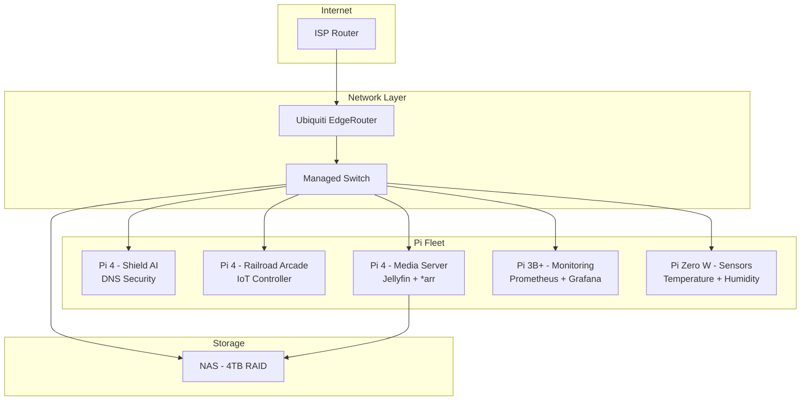

My home network runs on a fleet of Raspberry Pis. Each one serves a specific purpose: DNS filtering, IoT control, media serving, and network monitoring. This article covers the complete setup—from initial configuration to production deployment.

## The Fleet Overview

I currently run 5 Raspberry Pis, each with a dedicated role:



## Hardware Setup

### Pi 4 Specs (Main Units)

| Component | Specification |
|-----------|---------------|
| Model | Raspberry Pi 4 Model B |
| RAM | 4GB (Shield AI) / 2GB (others) |
| Storage | 64GB Samsung EVO microSD |
| Power | Official 5.1V 3A USB-C |
| Cooling | Argon ONE M.2 case (passive) |
| Network | Ethernet (no WiFi for stability) |

### The Power Situation

Running 5 Pis requires proper power management:

```
┌─────────────────────────────────────┐
│     Anker 60W 6-Port USB Hub        │
├─────────────────────────────────────┤
│  Port 1: Pi 4 (Shield AI)    3.0A   │
│  Port 2: Pi 4 (Railroad)     2.4A   │
│  Port 3: Pi 4 (Media)        3.0A   │
│  Port 4: Pi 3B+ (Monitoring) 2.4A   │
│  Port 5: Pi Zero (Sensors)   1.0A   │
│  Port 6: Reserved            —      │
└─────────────────────────────────────┘
         │
         ▼
    UPS (CyberPower 600VA)
         │
         ▼
    Wall Outlet
```

The UPS provides ~15 minutes of runtime during outages—enough for graceful shutdown.

## Initial Setup Script

I use the same base configuration for all Pis. Here's my setup script:

```bash
#!/bin/bash
# pi-setup.sh - Base configuration for all Pis

set -e

# Variables (customize per device)
HOSTNAME=${1:-"pi-generic"}
STATIC_IP=${2:-"192.168.1.100"}
GATEWAY="192.168.1.1"

echo "Setting up $HOSTNAME with IP $STATIC_IP..."

# 1. Update system
sudo apt update && sudo apt upgrade -y

# 2. Set hostname
sudo hostnamectl set-hostname "$HOSTNAME"
echo "$STATIC_IP $HOSTNAME" | sudo tee -a /etc/hosts

# 3. Configure static IP
cat <<EOF | sudo tee /etc/dhcpcd.conf
interface eth0
static ip_address=$STATIC_IP/24
static routers=$GATEWAY
static domain_name_servers=1.1.1.1 8.8.8.8
EOF

# 4. Install common packages
sudo apt install -y \
    vim \
    htop \
    git \
    curl \
    wget \
    ufw \
    fail2ban \
    unattended-upgrades

# 5. Configure firewall
sudo ufw default deny incoming
sudo ufw default allow outgoing
sudo ufw allow ssh
sudo ufw enable

# 6. Harden SSH
sudo sed -i 's/#PasswordAuthentication yes/PasswordAuthentication no/' /etc/ssh/sshd_config
sudo sed -i 's/#PermitRootLogin prohibit-password/PermitRootLogin no/' /etc/ssh/sshd_config
sudo systemctl restart sshd

# 7. Install Docker
curl -fsSL https://get.docker.com | sh
sudo usermod -aG docker $USER

# 8. Configure unattended upgrades
sudo dpkg-reconfigure -plow unattended-upgrades

# 9. Set timezone
sudo timedatectl set-timezone America/Los_Angeles

# 10. Create swap (2GB for 4GB models)
sudo dphys-swapfile swapoff
echo "CONF_SWAPSIZE=2048" | sudo tee /etc/dphys-swapfile
sudo dphys-swapfile setup
sudo dphys-swapfile swapon

echo "Setup complete. Reboot required."
```

Run with:
```bash
chmod +x pi-setup.sh
./pi-setup.sh "pi-shield" "192.168.1.10"
sudo reboot
```

## Shield AI DNS Server

My primary Pi runs Shield AI—a custom DNS security system. See the [full article](/blog/shield-ai-dns-security) for details, but here's the deployment:

```yaml
# docker-compose.yml for Shield AI
version: '3.8'

services:
  shield-ai:
    image: punitmishra/shield-ai:latest
    container_name: shield-ai
    restart: unless-stopped
    ports:
      - "53:53/udp"
      - "53:53/tcp"
      - "8080:8080"
    environment:
      - CACHE_SIZE=50000
      - CACHE_TTL=300
      - RUST_LOG=info
      - ML_MODEL_PATH=/models/dga_detector.onnx
    volumes:
      - ./config:/config
      - ./models:/models
      - ./blocklists:/blocklists
    networks:
      - dns-net

  redis:
    image: redis:alpine
    container_name: shield-redis
    restart: unless-stopped
    command: redis-server --maxmemory 128mb --maxmemory-policy allkeys-lru
    networks:
      - dns-net

  prometheus:
    image: prom/prometheus:latest
    container_name: shield-prometheus
    restart: unless-stopped
    volumes:
      - ./prometheus.yml:/etc/prometheus/prometheus.yml
      - prometheus-data:/prometheus
    networks:
      - dns-net

networks:
  dns-net:
    driver: bridge

volumes:
  prometheus-data:
```

### Router Configuration

Point all DNS queries to the Pi:

```
# EdgeRouter configuration
set service dhcp-server shared-network-name LAN subnet 192.168.1.0/24 dns-server 192.168.1.10
```

## Railroad Arcade IoT Controller

The second Pi 4 runs the Railroad Arcade bridge service:

```yaml
# docker-compose.yml for Railroad Arcade
version: '3.8'

services:
  railroad-bridge:
    build: ./bridge
    container_name: railroad-bridge
    restart: unless-stopped
    devices:
      - /dev/ttyACM0:/dev/ttyACM0  # Circuit Playground Express
    ports:
      - "8765:8765"  # WebSocket
    environment:
      - SERIAL_PORT=/dev/ttyACM0
      - BAUD_RATE=115200
      - WS_PORT=8765

  camera-stream:
    image: mpromonet/v4l2rtspserver
    container_name: camera-stream
    restart: unless-stopped
    devices:
      - /dev/video0:/dev/video0
    ports:
      - "8554:8554"
    command: -W 1280 -H 720 -F 30 -P 8554

  cloudflared:
    image: cloudflare/cloudflared:latest
    container_name: cloudflared
    restart: unless-stopped
    command: tunnel run
    environment:
      - TUNNEL_TOKEN=${CLOUDFLARE_TUNNEL_TOKEN}
```

### USB Device Persistence

USB devices can change names between reboots. Use udev rules for consistency:

```bash
# /etc/udev/rules.d/99-usb-serial.rules
SUBSYSTEM=="tty", ATTRS{idVendor}=="239a", ATTRS{idProduct}=="8019", SYMLINK+="circuit-playground"
```

Now the CPX is always available at `/dev/circuit-playground`.

## Media Server Stack

The third Pi runs my media stack:

```yaml
# docker-compose.yml for Media Server
version: '3.8'

services:
  jellyfin:
    image: jellyfin/jellyfin:latest
    container_name: jellyfin
    restart: unless-stopped
    ports:
      - "8096:8096"
    volumes:
      - ./jellyfin/config:/config
      - ./jellyfin/cache:/cache
      - /mnt/nas/media:/media:ro
    environment:
      - JELLYFIN_PublishedServerUrl=http://192.168.1.12:8096
    group_add:
      - "video"  # Hardware transcoding

  sonarr:
    image: linuxserver/sonarr:latest
    container_name: sonarr
    restart: unless-stopped
    ports:
      - "8989:8989"
    volumes:
      - ./sonarr:/config
      - /mnt/nas/media/tv:/tv
      - /mnt/nas/downloads:/downloads
    environment:
      - PUID=1000
      - PGID=1000
      - TZ=America/Los_Angeles

  radarr:
    image: linuxserver/radarr:latest
    container_name: radarr
    restart: unless-stopped
    ports:
      - "7878:7878"
    volumes:
      - ./radarr:/config
      - /mnt/nas/media/movies:/movies
      - /mnt/nas/downloads:/downloads
    environment:
      - PUID=1000
      - PGID=1000
      - TZ=America/Los_Angeles

  transmission:
    image: linuxserver/transmission:latest
    container_name: transmission
    restart: unless-stopped
    ports:
      - "9091:9091"
      - "51413:51413"
      - "51413:51413/udp"
    volumes:
      - ./transmission:/config
      - /mnt/nas/downloads:/downloads
    environment:
      - PUID=1000
      - PGID=1000
      - TZ=America/Los_Angeles
```

### NAS Mount

Mount the NAS automatically at boot:

```bash
# /etc/fstab
192.168.1.100:/volume1/media /mnt/nas nfs defaults,noatime 0 0
```

## Monitoring Stack

The Pi 3B+ runs monitoring for the entire fleet:

```yaml
# docker-compose.yml for Monitoring
version: '3.8'

services:
  prometheus:
    image: prom/prometheus:latest
    container_name: prometheus
    restart: unless-stopped
    ports:
      - "9090:9090"
    volumes:
      - ./prometheus/prometheus.yml:/etc/prometheus/prometheus.yml
      - prometheus-data:/prometheus
    command:
      - '--config.file=/etc/prometheus/prometheus.yml'
      - '--storage.tsdb.retention.time=30d'

  grafana:
    image: grafana/grafana:latest
    container_name: grafana
    restart: unless-stopped
    ports:
      - "3000:3000"
    volumes:
      - grafana-data:/var/lib/grafana
      - ./grafana/provisioning:/etc/grafana/provisioning
    environment:
      - GF_SECURITY_ADMIN_PASSWORD=${GRAFANA_PASSWORD}
      - GF_USERS_ALLOW_SIGN_UP=false

  node-exporter:
    image: prom/node-exporter:latest
    container_name: node-exporter
    restart: unless-stopped
    ports:
      - "9100:9100"
    volumes:
      - /proc:/host/proc:ro
      - /sys:/host/sys:ro
      - /:/rootfs:ro
    command:
      - '--path.procfs=/host/proc'
      - '--path.sysfs=/host/sys'
      - '--collector.filesystem.mount-points-exclude=^/(sys|proc|dev|host|etc)($$|/)'

  cadvisor:
    image: gcr.io/cadvisor/cadvisor:latest
    container_name: cadvisor
    restart: unless-stopped
    ports:
      - "8081:8080"
    volumes:
      - /:/rootfs:ro
      - /var/run:/var/run:ro
      - /sys:/sys:ro
      - /var/lib/docker/:/var/lib/docker:ro

volumes:
  prometheus-data:
  grafana-data:
```

### Prometheus Configuration

```yaml
# prometheus.yml
global:
  scrape_interval: 15s
  evaluation_interval: 15s

scrape_configs:
  - job_name: 'prometheus'
    static_configs:
      - targets: ['localhost:9090']

  - job_name: 'pi-shield'
    static_configs:
      - targets: ['192.168.1.10:9100']

  - job_name: 'pi-railroad'
    static_configs:
      - targets: ['192.168.1.11:9100']

  - job_name: 'pi-media'
    static_configs:
      - targets: ['192.168.1.12:9100']

  - job_name: 'shield-ai'
    static_configs:
      - targets: ['192.168.1.10:8080']
    metrics_path: /metrics

  - job_name: 'cadvisor'
    static_configs:
      - targets: ['192.168.1.13:8081']
```

## Pi Zero Sensor Node

The Pi Zero W runs a lightweight sensor collection script:

```python
#!/usr/bin/env python3
# sensor_node.py - Temperature/Humidity monitoring

import time
import json
import board
import adafruit_dht
import requests
from prometheus_client import start_http_server, Gauge

# Prometheus metrics
TEMPERATURE = Gauge('room_temperature_celsius', 'Room temperature in Celsius')
HUMIDITY = Gauge('room_humidity_percent', 'Room humidity percentage')

# DHT22 sensor on GPIO4
dht = adafruit_dht.DHT22(board.D4)

def read_sensor():
    """Read temperature and humidity from DHT22"""
    try:
        temperature = dht.temperature
        humidity = dht.humidity

        if temperature is not None and humidity is not None:
            TEMPERATURE.set(temperature)
            HUMIDITY.set(humidity)
            return temperature, humidity
    except RuntimeError as e:
        # DHT sensors can be flaky, retry on next loop
        print(f"Sensor error: {e}")
    return None, None

def main():
    # Start Prometheus metrics server
    start_http_server(9100)
    print("Sensor node running on :9100")

    while True:
        temp, humidity = read_sensor()
        if temp:
            print(f"Temperature: {temp:.1f}°C, Humidity: {humidity:.1f}%")
        time.sleep(60)  # Read every minute

if __name__ == "__main__":
    main()
```

## Backup Strategy

All configuration is backed up nightly:

```bash
#!/bin/bash
# backup-pis.sh - Run from a central machine

BACKUP_DIR="/mnt/nas/backups/pis"
DATE=$(date +%Y%m%d)

declare -A PIS=(
    ["shield"]="192.168.1.10"
    ["railroad"]="192.168.1.11"
    ["media"]="192.168.1.12"
    ["monitoring"]="192.168.1.13"
)

for name in "${!PIS[@]}"; do
    ip="${PIS[$name]}"
    echo "Backing up $name ($ip)..."

    mkdir -p "$BACKUP_DIR/$name"

    rsync -avz --delete \
        "pi@$ip:~/docker/" \
        "$BACKUP_DIR/$name/$DATE/"

    # Keep last 7 days
    find "$BACKUP_DIR/$name" -maxdepth 1 -type d -mtime +7 -exec rm -rf {} \;
done

echo "Backup complete!"
```

## Lessons Learned

After running this setup for 2+ years:

1. **Ethernet over WiFi** - WiFi is unreliable for always-on services. Use Ethernet.
2. **Quality power supplies** - Most "random reboots" are power issues.
3. **Docker simplifies everything** - Easy updates, rollbacks, and portability.
4. **Monitor everything** - Prometheus + Grafana catches issues before they're problems.
5. **UPS is essential** - SD cards corrupt easily during power loss.
6. **64GB+ SD cards** - Logs and Docker images fill up fast.

Total investment: ~$400 for 5 Pis with accessories. Value delivered: Priceless control over my home network.
