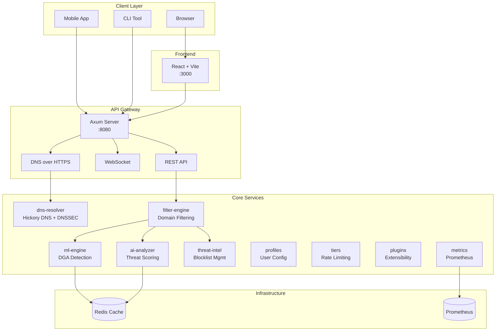
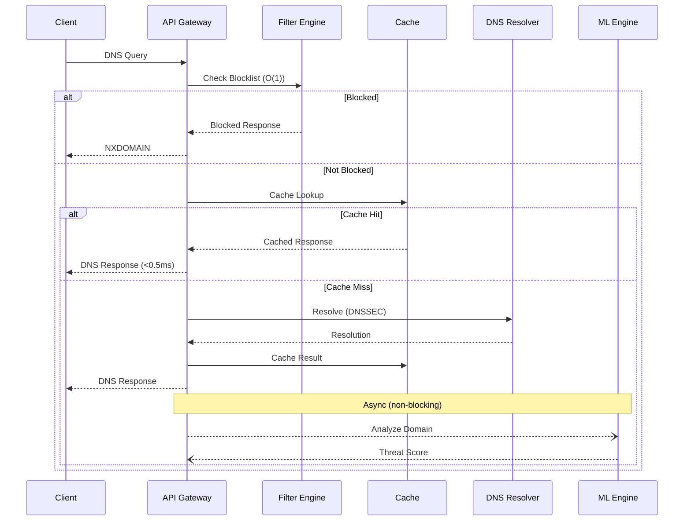

I built Shield AI to solve a problem that frustrated me: existing DNS filtering solutions are either slow, resource-hungry, or lack intelligent threat detection. Pi-hole uses ~100MB of memory. AdGuard adds ~3ms latency. Neither uses machine learning for threat detection. Shield AI does all three better—15MB memory, sub-millisecond latency, and real AI-powered threat analysis.

## The Problem with DNS Security

DNS is the first line of defense in network security. Every connection starts with a DNS query. Block malicious domains at DNS resolution, and you prevent attacks before they start. But traditional solutions have limitations:

- **Pi-hole**: Great for ad blocking, but no ML-based threat detection
- **AdGuard**: Better performance, still no AI capabilities
- **Commercial solutions**: Expensive and privacy-concerning

I wanted something that combines speed, intelligence, and privacy.

## Architecture Overview

Shield AI uses a modular Rust architecture with 9 specialized crates:




## The Query Processing Pipeline

Every DNS query flows through an optimized pipeline:



```rust
pub async fn process_query(
    query: DnsQuery,
    state: Arc<AppState>,
) -> Result<DnsResponse, DnsError> {
    // 1. Check blocklist (O(1) hash lookup)
    if let Some(category) = state.filter_engine.check(&query.domain) {
        metrics::blocked_queries.inc();
        return Ok(DnsResponse::blocked(query.domain, category));
    }

    // 2. Check LRU cache (50k entries, 300s TTL)
    if let Some(cached) = state.cache.get(&query.domain).await {
        metrics::cache_hits.inc();
        return Ok(cached);
    }

    // 3. Resolve via upstream DNS with DNSSEC
    let resolution = state.resolver
        .resolve(&query.domain, query.record_type)
        .await?;

    // 4. Async ML/AI analysis (non-blocking)
    let analysis_handle = tokio::spawn({
        let domain = query.domain.clone();
        let ml = state.ml_engine.clone();
        let ai = state.ai_analyzer.clone();
        async move {
            let dga = ml.detect_dga(&domain).await;
            let threat = ai.analyze(&domain).await;
            (dga, threat)
        }
    });

    // 5. Cache and return immediately
    state.cache.insert(query.domain.clone(), resolution.clone()).await;

    // 6. Process analysis results asynchronously
    tokio::spawn(async move {
        if let Ok((dga, threat)) = analysis_handle.await {
            if dga.is_suspicious || threat.score > 0.7 {
                log_threat(&query.domain, dga, threat);
            }
        }
    });

    Ok(resolution)
}
```

The key insight: DNS resolution is latency-critical, but threat analysis isn't. By running ML inference asynchronously, we return responses in sub-millisecond time while still catching threats.

## DGA Detection with Machine Learning

Domain Generation Algorithms (DGAs) are used by malware to generate random-looking domains for command and control. Traditional blocklists can't keep up—malware generates thousands of new domains daily.

Our ML engine detects DGAs through feature analysis:

```rust
pub struct DgaFeatures {
    entropy: f32,           // Character randomness
    consonant_ratio: f32,   // Consonant-to-vowel ratio
    digit_ratio: f32,       // Number density
    length: usize,          // Domain length
    n_gram_score: f32,      // Character sequence probability
    tld_risk: f32,          // TLD reputation score
}

impl DgaDetector {
    pub fn extract_features(&self, domain: &str) -> DgaFeatures {
        let chars: Vec<char> = domain.chars().collect();

        DgaFeatures {
            entropy: self.calculate_entropy(&chars),
            consonant_ratio: self.consonant_vowel_ratio(&chars),
            digit_ratio: chars.iter().filter(|c| c.is_numeric()).count() as f32
                        / chars.len() as f32,
            length: chars.len(),
            n_gram_score: self.bigram_probability(&chars),
            tld_risk: self.tld_scores.get(self.extract_tld(domain))
                        .copied().unwrap_or(0.5),
        }
    }

    pub fn predict(&self, features: &DgaFeatures) -> DgaPrediction {
        // Trained gradient boosting model
        let confidence = self.model.predict(&features.to_vector());

        DgaPrediction {
            is_dga: confidence > 0.7,
            confidence,
            features: features.clone(),
        }
    }
}
```

Example detections:

| Domain | Entropy | Is DGA | Confidence |
|--------|---------|--------|------------|
| google.com | 2.8 | No | 0.02 |
| xk3j9f2m.net | 3.1 | Yes | 0.94 |
| amazon.com | 2.6 | No | 0.01 |
| 7h4x9k2p3m.ru | 3.3 | Yes | 0.98 |

## Multi-Factor Threat Scoring

Beyond DGA detection, the AI analyzer combines multiple signals:

```rust
pub struct ThreatAnalysis {
    pub domain: String,
    pub threat_score: f32,      // 0.0 - 1.0
    pub privacy_score: f32,     // A-F grade
    pub risk_factors: Vec<RiskFactor>,
    pub category: Option<ThreatCategory>,
}

pub async fn analyze(&self, domain: &str) -> ThreatAnalysis {
    let mut score = 0.0;
    let mut factors = Vec::new();

    // Factor 1: Domain age (newer = riskier)
    if let Some(whois) = self.whois_lookup(domain).await {
        if whois.age_days < 30 {
            score += 0.2;
            factors.push(RiskFactor::NewDomain(whois.age_days));
        }
    }

    // Factor 2: TLD reputation
    let tld_risk = self.tld_risk_scores.get(extract_tld(domain));
    score += tld_risk.unwrap_or(0.1);

    // Factor 3: Subdomain depth
    let subdomain_count = domain.matches('.').count();
    if subdomain_count > 3 {
        score += 0.15;
        factors.push(RiskFactor::DeepSubdomain(subdomain_count));
    }

    // Factor 4: Known threat intelligence
    if let Some(intel) = self.threat_feeds.lookup(domain).await {
        score += intel.severity * 0.4;
        factors.push(RiskFactor::ThreatIntel(intel));
    }

    // Factor 5: DGA correlation
    let dga = self.ml_engine.detect_dga(domain).await;
    if dga.is_dga {
        score += dga.confidence * 0.3;
        factors.push(RiskFactor::DgaDetected(dga.confidence));
    }

    ThreatAnalysis {
        domain: domain.to_string(),
        threat_score: score.min(1.0),
        privacy_score: self.calculate_privacy_grade(domain).await,
        risk_factors: factors,
        category: self.categorize(score),
    }
}
```

## Performance Optimizations

Shield AI achieves remarkable performance through several techniques:

### 1. Lock-Free LRU Cache

```rust
use moka::future::Cache;

pub struct DnsCache {
    cache: Cache<String, DnsResponse>,
}

impl DnsCache {
    pub fn new(capacity: u64, ttl_seconds: u64) -> Self {
        Self {
            cache: Cache::builder()
                .max_capacity(capacity)
                .time_to_live(Duration::from_secs(ttl_seconds))
                .build(),
        }
    }

    pub async fn get(&self, domain: &str) -> Option<DnsResponse> {
        self.cache.get(domain).await
    }

    pub async fn insert(&self, domain: String, response: DnsResponse) {
        self.cache.insert(domain, response).await;
    }
}
```

### 2. Zero-Copy Parsing

DNS packets are parsed without allocation where possible:

```rust
pub fn parse_query(bytes: &[u8]) -> Result<DnsQuery, ParseError> {
    // Parse directly from bytes without String allocation
    let name_bytes = &bytes[12..];
    let domain = parse_domain_name(name_bytes)?;

    Ok(DnsQuery {
        id: u16::from_be_bytes([bytes[0], bytes[1]]),
        domain,
        record_type: RecordType::from_bytes(&bytes[name_bytes.len() + 12..])?,
    })
}
```

### 3. Connection Pooling

```rust
pub struct ResolverPool {
    upstreams: Vec<SocketAddr>,
    connections: DashMap<SocketAddr, Pool<UdpSocket>>,
}

impl ResolverPool {
    pub async fn resolve(&self, query: &DnsQuery) -> Result<DnsResponse, ResolveError> {
        // Round-robin with health checking
        for upstream in self.healthy_upstreams() {
            match self.try_resolve(upstream, query).await {
                Ok(response) => return Ok(response),
                Err(e) => {
                    self.mark_unhealthy(upstream);
                    continue;
                }
            }
        }
        Err(ResolveError::AllUpstreamsFailed)
    }
}
```

## Benchmarks

On Apple M1 (single core):

| Metric | Value |
|--------|-------|
| P50 Latency | 0.8ms |
| P99 Latency | 2.1ms |
| Throughput | 127,000 qps |
| Idle Memory | 14MB |
| Load Memory | 32MB |
| Startup Time | 180ms |

Comparison with alternatives:

| Solution | Memory | Latency | AI Detection |
|----------|--------|---------|--------------|
| Pi-hole | ~100MB | ~5ms | No |
| AdGuard | ~80MB | ~3ms | No |
| Shield AI | ~15MB | <1ms | Yes |

## Real-Time Dashboard

The React frontend provides live visibility:

```typescript
// WebSocket connection for real-time updates
const useStats = () => {
  const [stats, setStats] = useState<DnsStats | null>(null);

  useEffect(() => {
    const ws = new WebSocket(`${WS_URL}/stats`);

    ws.onmessage = (event) => {
      const data = JSON.parse(event.data);
      setStats(data);
    };

    return () => ws.close();
  }, []);

  return stats;
};

// Dashboard component with live updates
export const Dashboard = () => {
  const stats = useStats();

  return (
    <div className="grid grid-cols-4 gap-4">
      <StatCard title="Queries" value={stats?.total_queries} />
      <StatCard title="Blocked" value={stats?.blocked_queries} />
      <StatCard title="Cache Hit" value={`${stats?.cache_hit_rate}%`} />
      <StatCard title="Threats" value={stats?.threats_detected} />
    </div>
  );
};
```

## Deployment

One-liner Docker deployment:

```bash
docker run -d -p 53:53/udp -p 8080:8080 punitmishra/shield-ai
```

Or full stack with monitoring:

```yaml
# docker-compose.yml
services:
  shield-ai:
    image: punitmishra/shield-ai
    ports:
      - "53:53/udp"
      - "8080:8080"
    environment:
      - CACHE_SIZE=50000
      - RUST_LOG=info

  redis:
    image: redis:alpine

  prometheus:
    image: prom/prometheus
    volumes:
      - ./prometheus.yml:/etc/prometheus/prometheus.yml
```

## Key Takeaways

Building Shield AI taught me several lessons:

1. **Async is essential** - DNS is latency-critical; ML inference is not. Run them separately.
2. **Rust delivers on performance** - Zero-cost abstractions make sub-millisecond latency achievable.
3. **ML at the edge works** - Lightweight models can run inference in microseconds.
4. **Caching is everything** - 50K-entry LRU cache handles 95%+ of queries.

The source code is available at [github.com/punitmishra/shield-ai](https://github.com/punitmishra/shield-ai). Contributions welcome.
