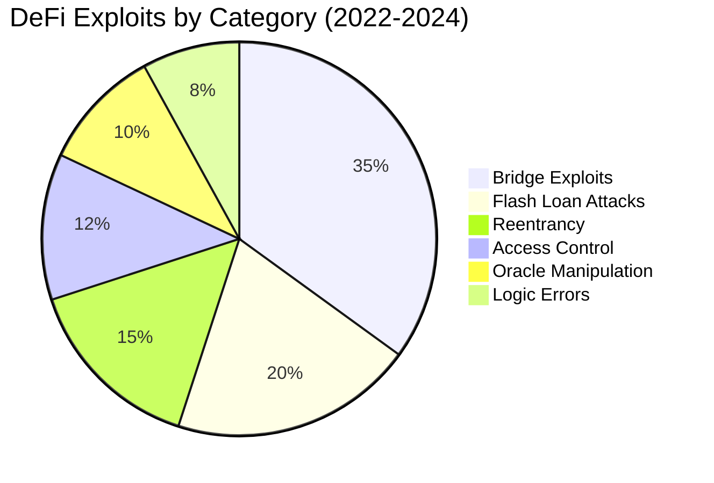
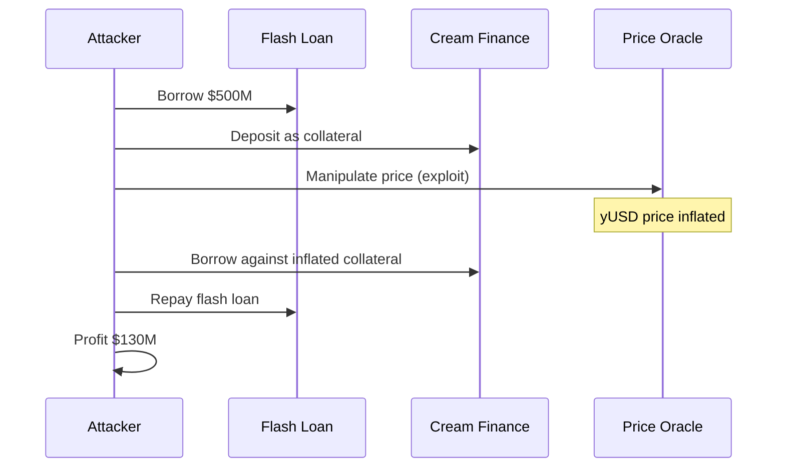
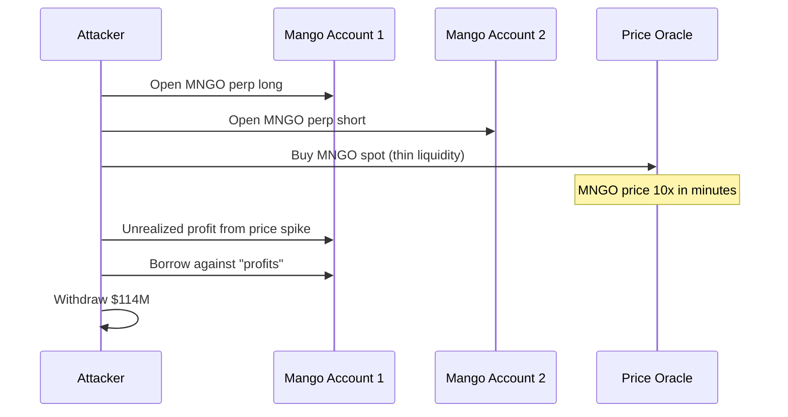
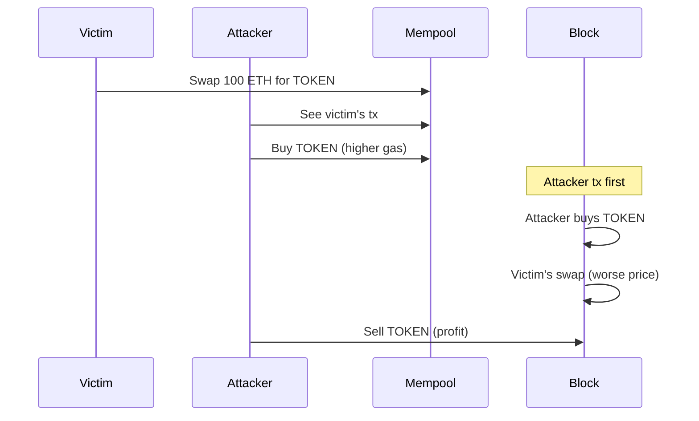

Over $3 billion was stolen from smart contracts in 2022 alone. Most exploits stem from a handful of vulnerability classes that are preventable. This article dissects real attacks, explains the underlying vulnerabilities, and provides defensive patterns.

## The Attack Landscape



## 1. Reentrancy Attacks

The classic vulnerability. An attacker recursively calls back into your contract before state updates complete.

### The DAO Hack (2016) - $60M

```solidity
// VULNERABLE: The DAO's withdraw function
function withdraw(uint amount) public {
    require(balances[msg.sender] >= amount);

    // External call BEFORE state update
    (bool success, ) = msg.sender.call{value: amount}("");
    require(success);

    // State update happens AFTER external call
    balances[msg.sender] -= amount;  // Never reached during attack
}
```

The attacker's contract:
```solidity
contract Attacker {
    DAO public dao;
    uint public count;

    function attack() external payable {
        dao.deposit{value: msg.value}();
        dao.withdraw(msg.value);
    }

    receive() external payable {
        if (count < 10) {
            count++;
            dao.withdraw(msg.value);  // Re-enter before balance updated
        }
    }
}
```

### Defense: Checks-Effects-Interactions

```solidity
// SECURE: State update before external call
function withdraw(uint amount) public nonReentrant {
    // 1. Checks
    require(balances[msg.sender] >= amount, "Insufficient balance");

    // 2. Effects (state changes)
    balances[msg.sender] -= amount;

    // 3. Interactions (external calls)
    (bool success, ) = msg.sender.call{value: amount}("");
    require(success, "Transfer failed");
}
```

Always use OpenZeppelin's `ReentrancyGuard`:
```solidity
import "@openzeppelin/contracts/utils/ReentrancyGuard.sol";

contract Vault is ReentrancyGuard {
    function withdraw(uint amount) external nonReentrant {
        // Protected from reentrancy
    }
}
```

## 2. Flash Loan Attacks

Flash loans allow borrowing unlimited assets with zero collateral—if repaid in the same transaction. Attackers use them to manipulate prices or exploit logic.

### Cream Finance Hack (2021) - $130M



### Defense: Time-Weighted Average Prices (TWAPs)

```solidity
// Using Uniswap V3 TWAP
import "@uniswap/v3-core/contracts/interfaces/IUniswapV3Pool.sol";

function getTWAP(address pool, uint32 period) public view returns (uint256) {
    uint32[] memory secondsAgos = new uint32[](2);
    secondsAgos[0] = period;
    secondsAgos[1] = 0;

    (int56[] memory tickCumulatives, ) = IUniswapV3Pool(pool)
        .observe(secondsAgos);

    int56 tickCumulativesDelta = tickCumulatives[1] - tickCumulatives[0];
    int24 tick = int24(tickCumulativesDelta / int56(uint56(period)));

    return OracleLibrary.getQuoteAtTick(tick, baseAmount, baseToken, quoteToken);
}
```

Additional defenses:
- Use multiple oracle sources (Chainlink + Uniswap TWAP)
- Implement price deviation checks
- Add time delays for large operations

## 3. Access Control Vulnerabilities

Missing or incorrect access control is shockingly common.

### Poly Network Hack (2021) - $611M

The attacker called a function that should have been restricted:

```solidity
// VULNERABLE: Missing access control
function setOwner(address newOwner) public {
    owner = newOwner;  // Anyone can call!
}
```

### Parity Wallet Freeze (2017) - $150M

A library contract was left uninitialized:

```solidity
// VULNERABLE: Unprotected initializer
function initWallet(address[] _owners, uint _required) public {
    // No check if already initialized!
    owners = _owners;
    required = _required;
}
```

An attacker called `initWallet`, became owner, and then `selfdestruct`ed the library—freezing $150M forever.

### Defense: Proper Access Control

```solidity
import "@openzeppelin/contracts/access/Ownable.sol";
import "@openzeppelin/contracts/access/AccessControl.sol";

contract SecureContract is AccessControl {
    bytes32 public constant ADMIN_ROLE = keccak256("ADMIN_ROLE");
    bytes32 public constant OPERATOR_ROLE = keccak256("OPERATOR_ROLE");

    bool private initialized;

    function initialize(address admin) external {
        require(!initialized, "Already initialized");
        initialized = true;

        _grantRole(DEFAULT_ADMIN_ROLE, admin);
        _grantRole(ADMIN_ROLE, admin);
    }

    function adminFunction() external onlyRole(ADMIN_ROLE) {
        // Protected
    }

    function operatorFunction() external onlyRole(OPERATOR_ROLE) {
        // Protected
    }
}
```

## 4. Oracle Manipulation

DeFi protocols rely on price oracles. Manipulate the oracle, manipulate the protocol.

### Mango Markets Exploit (2022) - $114M



### Defense: Multi-Source Oracles

```solidity
contract SecureOracle {
    IChainlinkAggregator public chainlink;
    IUniswapV3Pool public uniswapPool;

    uint256 public constant MAX_DEVIATION = 500; // 5%

    function getPrice() public view returns (uint256) {
        uint256 chainlinkPrice = getChainlinkPrice();
        uint256 twapPrice = getTWAP();

        // Check deviation
        uint256 deviation = chainlinkPrice > twapPrice
            ? ((chainlinkPrice - twapPrice) * 10000) / twapPrice
            : ((twapPrice - chainlinkPrice) * 10000) / chainlinkPrice;

        require(deviation <= MAX_DEVIATION, "Price deviation too high");

        // Use average
        return (chainlinkPrice + twapPrice) / 2;
    }

    function getChainlinkPrice() internal view returns (uint256) {
        (, int256 price, , uint256 updatedAt, ) = chainlink.latestRoundData();
        require(price > 0, "Invalid price");
        require(block.timestamp - updatedAt < 1 hours, "Stale price");
        return uint256(price);
    }
}
```

## 5. Integer Overflow/Underflow

Pre-Solidity 0.8, arithmetic operations could silently overflow.

### BeautyChain (BEC) Hack (2018)

```solidity
// VULNERABLE (Solidity < 0.8)
function batchTransfer(address[] _receivers, uint256 _value) public {
    uint256 amount = _receivers.length * _value;  // Overflow!

    require(balances[msg.sender] >= amount);
    balances[msg.sender] -= amount;

    for (uint256 i = 0; i < _receivers.length; i++) {
        balances[_receivers[i]] += _value;
    }
}
```

With `_receivers.length = 2` and `_value = 2^255`, the multiplication overflows to a small number, bypassing the balance check.

### Defense: Use Solidity 0.8+

```solidity
// Solidity 0.8+ has built-in overflow checks
pragma solidity ^0.8.0;

// This will revert on overflow automatically
uint256 amount = _receivers.length * _value;

// For unchecked math (when you're sure it's safe):
unchecked {
    // No overflow checks here
    counter++;
}
```

## 6. Signature Replay

Signatures valid on one chain/contract can be replayed elsewhere.

```solidity
// VULNERABLE: No replay protection
function executeWithSignature(
    address to,
    uint256 value,
    bytes memory signature
) external {
    bytes32 hash = keccak256(abi.encodePacked(to, value));
    address signer = ECDSA.recover(hash, signature);
    require(signer == owner, "Invalid signature");

    // Same signature can be used again!
    (bool success, ) = to.call{value: value}("");
    require(success);
}
```

### Defense: EIP-712 Typed Signatures

```solidity
import "@openzeppelin/contracts/utils/cryptography/EIP712.sol";
import "@openzeppelin/contracts/utils/cryptography/ECDSA.sol";

contract SecureSignatures is EIP712 {
    mapping(address => uint256) public nonces;

    bytes32 private constant EXECUTE_TYPEHASH = keccak256(
        "Execute(address to,uint256 value,uint256 nonce,uint256 deadline)"
    );

    constructor() EIP712("SecureContract", "1") {}

    function execute(
        address to,
        uint256 value,
        uint256 deadline,
        bytes memory signature
    ) external {
        require(block.timestamp <= deadline, "Expired");

        bytes32 structHash = keccak256(
            abi.encode(
                EXECUTE_TYPEHASH,
                to,
                value,
                nonces[msg.sender]++,  // Increment nonce
                deadline
            )
        );

        bytes32 hash = _hashTypedDataV4(structHash);
        address signer = ECDSA.recover(hash, signature);
        require(signer == owner, "Invalid signature");

        (bool success, ) = to.call{value: value}("");
        require(success);
    }
}
```

## 7. Front-Running and MEV

Transactions in the mempool are visible. Attackers can front-run profitable operations.



### Defense: Commit-Reveal Schemes

```solidity
contract SecureAuction {
    struct Bid {
        bytes32 commitment;
        uint256 deposit;
        uint256 revealedAmount;
        bool revealed;
    }

    mapping(address => Bid) public bids;

    // Phase 1: Commit
    function commit(bytes32 commitment) external payable {
        bids[msg.sender] = Bid({
            commitment: commitment,
            deposit: msg.value,
            revealedAmount: 0,
            revealed: false
        });
    }

    // Phase 2: Reveal
    function reveal(uint256 amount, bytes32 salt) external {
        Bid storage bid = bids[msg.sender];
        require(!bid.revealed, "Already revealed");

        bytes32 commitment = keccak256(abi.encodePacked(amount, salt));
        require(commitment == bid.commitment, "Invalid reveal");
        require(bid.deposit >= amount, "Insufficient deposit");

        bid.revealedAmount = amount;
        bid.revealed = true;
    }
}
```

Other defenses:
- Private mempools (Flashbots Protect)
- Submarine sends
- Time-locks on large operations

## Security Audit Checklist

Before deployment, verify:

### Access Control
- [ ] All admin functions have proper modifiers
- [ ] Initializers can only be called once
- [ ] Role-based access is properly configured
- [ ] No default public visibility on state variables

### Reentrancy
- [ ] External calls are last (checks-effects-interactions)
- [ ] ReentrancyGuard on functions with external calls
- [ ] State is updated before transfers

### Arithmetic
- [ ] Using Solidity 0.8+ for overflow protection
- [ ] Division by zero checks where applicable
- [ ] Precision loss in calculations is acceptable

### Oracle Security
- [ ] Using time-weighted average prices
- [ ] Multiple oracle sources for critical prices
- [ ] Staleness checks on oracle data
- [ ] Deviation thresholds implemented

### Signature Security
- [ ] EIP-712 typed data for signatures
- [ ] Nonces prevent replay
- [ ] Deadlines for time-limited operations
- [ ] Chain ID in signature hash

### Flash Loan Resistance
- [ ] No single-transaction profit extraction possible
- [ ] Price impact checks for large trades
- [ ] Delayed execution for sensitive operations

## Tools for Security Analysis

```bash
# Slither - Static analysis
pip install slither-analyzer
slither contracts/

# Mythril - Symbolic execution
pip install mythril
myth analyze contracts/MyContract.sol

# Echidna - Fuzzing
brew install echidna
echidna-test contracts/ --config echidna.yaml

# Foundry invariant testing
forge test --match-contract InvariantTest
```

### Slither Example

```bash
$ slither contracts/Vault.sol

Vault.withdraw(uint256) (contracts/Vault.sol#15-22) sends eth to arbitrary user
	- (success) = msg.sender.call{value: amount}() (contracts/Vault.sol#20)
Dangerous calls:
	- (success) = msg.sender.call{value: amount}() (contracts/Vault.sol#20)

Reference: https://github.com/crytic/slither/wiki/Detector-Documentation#functions-that-send-ether-to-arbitrary-destinations
```

## Post-Deployment Monitoring

Even after deployment, stay vigilant:

1. **On-chain monitoring**: Set up alerts for unusual activity
2. **Bug bounty**: Offer rewards for vulnerability reports
3. **Incident response**: Have a plan for exploits
4. **Upgrades**: Timelock + multisig for any changes
5. **Insurance**: Consider coverage for TVL

```typescript
// Example: Forta agent for suspicious withdrawals
const handleTransaction: HandleTransaction = async (txEvent) => {
  const findings: Finding[] = [];

  const withdrawals = txEvent.filterLog(WITHDRAW_EVENT, CONTRACT_ADDRESS);

  for (const withdrawal of withdrawals) {
    const amount = BigInt(withdrawal.args.amount);

    if (amount > THRESHOLD) {
      findings.push(Finding.fromObject({
        name: "Large Withdrawal",
        description: `Withdrawal of ${amount} detected`,
        alertId: "LARGE-WITHDRAWAL",
        severity: FindingSeverity.Medium,
        type: FindingType.Suspicious,
      }));
    }
  }

  return findings;
};
```

Smart contract security is a discipline. The stakes are high—code is law, and bugs are permanent. Invest in audits, testing, and monitoring. The cost of prevention is always less than the cost of exploitation.

## References

- [SWC Registry](https://swcregistry.io/)
- [Consensys Smart Contract Best Practices](https://consensys.github.io/smart-contract-best-practices/)
- [Trail of Bits Building Secure Contracts](https://github.com/crytic/building-secure-contracts)
- [Rekt News](https://rekt.news/)
