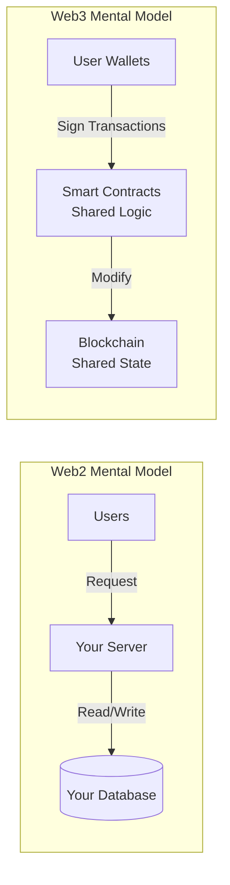

As a traditional backend engineer, transitioning to Web3 development felt like learning a new paradigm. This guide covers what I wish I knew when starting—the mental model shifts, tooling differences, and practical patterns for building decentralized applications.

## The Mental Model Shift

Web3 inverts many assumptions from traditional development:



| Web2 | Web3 |
|------|------|
| You control the server | Network controls execution |
| Database is private | State is public |
| Free reads, cheap writes | Reads free, writes cost gas |
| Bugs can be hotfixed | Deployed code is immutable |
| Auth via passwords/tokens | Auth via cryptographic signatures |
| Trust the server | Trust the code (trustless) |

## Development Environment Setup

### Essential Tools

```bash
# Node.js and package manager
nvm install 20
npm install -g pnpm

# Foundry (Solidity toolkit)
curl -L https://foundry.paradigm.xyz | bash
foundryup

# Hardhat (alternative framework)
pnpm add -D hardhat @nomicfoundation/hardhat-toolbox

# Local blockchain
pnpm add -D ganache

# Frontend libraries
pnpm add wagmi viem @rainbow-me/rainbowkit
```

### Project Structure

```
my-dapp/
├── contracts/           # Solidity contracts
│   ├── src/
│   ├── test/
│   └── script/
├── frontend/            # React/Next.js app
│   ├── src/
│   │   ├── components/
│   │   ├── hooks/
│   │   └── lib/
│   └── package.json
├── subgraph/            # The Graph indexer
│   ├── src/
│   └── subgraph.yaml
├── foundry.toml
└── package.json
```

## Smart Contract Fundamentals

### Your First Contract

```solidity
// SPDX-License-Identifier: MIT
pragma solidity ^0.8.20;

/// @title SimpleStorage
/// @notice A minimal contract demonstrating state and functions
contract SimpleStorage {
    // State variables (stored on-chain)
    uint256 private value;
    address public owner;

    // Events (for off-chain indexing)
    event ValueChanged(uint256 oldValue, uint256 newValue, address changedBy);

    // Errors (gas-efficient reverts)
    error NotOwner();
    error ValueTooLarge(uint256 max, uint256 provided);

    // Modifiers (reusable access control)
    modifier onlyOwner() {
        if (msg.sender != owner) revert NotOwner();
        _;
    }

    constructor(uint256 initialValue) {
        owner = msg.sender;
        value = initialValue;
    }

    /// @notice Read the stored value (free, no gas)
    function getValue() external view returns (uint256) {
        return value;
    }

    /// @notice Update the stored value (costs gas)
    function setValue(uint256 newValue) external onlyOwner {
        if (newValue > 1000000) {
            revert ValueTooLarge(1000000, newValue);
        }

        uint256 oldValue = value;
        value = newValue;

        emit ValueChanged(oldValue, newValue, msg.sender);
    }
}
```

### Testing with Foundry

```solidity
// test/SimpleStorage.t.sol
// SPDX-License-Identifier: MIT
pragma solidity ^0.8.20;

import "forge-std/Test.sol";
import "../src/SimpleStorage.sol";

contract SimpleStorageTest is Test {
    SimpleStorage public store;
    address public owner = address(1);
    address public other = address(2);

    function setUp() public {
        vm.prank(owner);
        store = new SimpleStorage(42);
    }

    function test_InitialValue() public view {
        assertEq(store.getValue(), 42);
    }

    function test_SetValue() public {
        vm.prank(owner);
        store.setValue(100);
        assertEq(store.getValue(), 100);
    }

    function test_RevertWhen_NotOwner() public {
        vm.prank(other);
        vm.expectRevert(SimpleStorage.NotOwner.selector);
        store.setValue(100);
    }

    function test_RevertWhen_ValueTooLarge() public {
        vm.prank(owner);
        vm.expectRevert(
            abi.encodeWithSelector(
                SimpleStorage.ValueTooLarge.selector,
                1000000,
                1000001
            )
        );
        store.setValue(1000001);
    }

    // Fuzz testing - Foundry generates random inputs
    function testFuzz_SetValue(uint256 newValue) public {
        vm.assume(newValue <= 1000000);
        vm.prank(owner);
        store.setValue(newValue);
        assertEq(store.getValue(), newValue);
    }
}
```

Run tests:
```bash
forge test -vvv
```

## Common Patterns

### 1. Ownable Pattern

```solidity
import "@openzeppelin/contracts/access/Ownable.sol";

contract MyContract is Ownable {
    constructor() Ownable(msg.sender) {}

    function adminFunction() external onlyOwner {
        // Only owner can call
    }
}
```

### 2. Pausable Pattern

```solidity
import "@openzeppelin/contracts/utils/Pausable.sol";

contract MyContract is Pausable, Ownable {
    function pause() external onlyOwner {
        _pause();
    }

    function unpause() external onlyOwner {
        _unpause();
    }

    function criticalFunction() external whenNotPaused {
        // Cannot be called when paused
    }
}
```

### 3. Reentrancy Guard

```solidity
import "@openzeppelin/contracts/utils/ReentrancyGuard.sol";

contract Vault is ReentrancyGuard {
    mapping(address => uint256) public balances;

    function withdraw() external nonReentrant {
        uint256 amount = balances[msg.sender];
        balances[msg.sender] = 0; // Update state BEFORE external call

        (bool success, ) = msg.sender.call{value: amount}("");
        require(success, "Transfer failed");
    }
}
```

### 4. Upgradeable Contracts

```solidity
// Using OpenZeppelin UUPS pattern
import "@openzeppelin/contracts-upgradeable/proxy/utils/UUPSUpgradeable.sol";

contract MyContractV1 is UUPSUpgradeable, OwnableUpgradeable {
    uint256 public value;

    function initialize(uint256 _value) public initializer {
        __Ownable_init(msg.sender);
        value = _value;
    }

    function _authorizeUpgrade(address) internal override onlyOwner {}
}

contract MyContractV2 is MyContractV1 {
    uint256 public newFeature;

    function setNewFeature(uint256 _value) external {
        newFeature = _value;
    }
}
```

## Frontend Integration

### Setting Up Wagmi + RainbowKit

```typescript
// lib/wagmi.ts
import { getDefaultConfig } from '@rainbow-me/rainbowkit';
import { mainnet, sepolia, base } from 'wagmi/chains';

export const config = getDefaultConfig({
  appName: 'My dApp',
  projectId: process.env.NEXT_PUBLIC_WALLET_CONNECT_ID!,
  chains: [mainnet, sepolia, base],
  ssr: true,
});
```

```tsx
// app/providers.tsx
'use client';

import { RainbowKitProvider } from '@rainbow-me/rainbowkit';
import { WagmiProvider } from 'wagmi';
import { QueryClient, QueryClientProvider } from '@tanstack/react-query';
import { config } from '@/lib/wagmi';

const queryClient = new QueryClient();

export function Providers({ children }: { children: React.ReactNode }) {
  return (
    <WagmiProvider config={config}>
      <QueryClientProvider client={queryClient}>
        <RainbowKitProvider>
          {children}
        </RainbowKitProvider>
      </QueryClientProvider>
    </WagmiProvider>
  );
}
```

### Reading Contract State

```typescript
// hooks/useSimpleStorage.ts
import { useReadContract, useWriteContract, useWaitForTransactionReceipt } from 'wagmi';
import { simpleStorageAbi } from '@/lib/abi';

const CONTRACT_ADDRESS = '0x...';

export function useSimpleStorage() {
  // Read value (no gas, instant)
  const { data: value, refetch } = useReadContract({
    address: CONTRACT_ADDRESS,
    abi: simpleStorageAbi,
    functionName: 'getValue',
  });

  // Write value (requires gas, async)
  const { writeContract, data: hash, isPending } = useWriteContract();

  // Wait for transaction confirmation
  const { isLoading: isConfirming, isSuccess } = useWaitForTransactionReceipt({
    hash,
  });

  const setValue = async (newValue: bigint) => {
    writeContract({
      address: CONTRACT_ADDRESS,
      abi: simpleStorageAbi,
      functionName: 'setValue',
      args: [newValue],
    });
  };

  return {
    value,
    setValue,
    isPending,
    isConfirming,
    isSuccess,
    refetch,
  };
}
```

### Component Example

```tsx
// components/StorageWidget.tsx
'use client';

import { useState } from 'react';
import { useSimpleStorage } from '@/hooks/useSimpleStorage';
import { ConnectButton } from '@rainbow-me/rainbowkit';
import { useAccount } from 'wagmi';

export function StorageWidget() {
  const { address } = useAccount();
  const { value, setValue, isPending, isConfirming, isSuccess } = useSimpleStorage();
  const [input, setInput] = useState('');

  const handleSubmit = (e: React.FormEvent) => {
    e.preventDefault();
    setValue(BigInt(input));
  };

  return (
    <div className="p-6 bg-white rounded-lg shadow">
      <ConnectButton />

      {address && (
        <>
          <div className="mt-4">
            <p className="text-gray-600">Current Value:</p>
            <p className="text-2xl font-bold">{value?.toString() ?? 'Loading...'}</p>
          </div>

          <form onSubmit={handleSubmit} className="mt-4">
            <input
              type="number"
              value={input}
              onChange={(e) => setInput(e.target.value)}
              className="border rounded px-3 py-2 w-full"
              placeholder="New value"
            />
            <button
              type="submit"
              disabled={isPending || isConfirming}
              className="mt-2 w-full bg-blue-600 text-white py-2 rounded disabled:opacity-50"
            >
              {isPending ? 'Confirm in wallet...' :
               isConfirming ? 'Confirming...' :
               'Update Value'}
            </button>
          </form>

          {isSuccess && (
            <p className="mt-2 text-green-600">Transaction confirmed!</p>
          )}
        </>
      )}
    </div>
  );
}
```

## Gas Optimization

Gas is the cost of computation. Optimize aggressively:

### 1. Storage is Expensive

```solidity
// Bad: Multiple storage writes
function badUpdate(uint256 a, uint256 b, uint256 c) external {
    value1 = a;  // 20,000 gas
    value2 = b;  // 20,000 gas
    value3 = c;  // 20,000 gas
}

// Good: Pack into single slot
struct Values {
    uint96 a;  // 12 bytes
    uint96 b;  // 12 bytes
    uint64 c;  // 8 bytes
}              // Total: 32 bytes = 1 slot

Values public values;

function goodUpdate(uint96 a, uint96 b, uint64 c) external {
    values = Values(a, b, c);  // Single storage write
}
```

### 2. Use Calldata for Read-Only Arrays

```solidity
// Bad: Memory copy
function sum(uint256[] memory numbers) external pure returns (uint256) {
    // ...
}

// Good: Direct calldata reference
function sum(uint256[] calldata numbers) external pure returns (uint256) {
    // ...
}
```

### 3. Short-Circuit Conditions

```solidity
// Bad: Always evaluates both
require(expensiveCheck() && cheapCheck());

// Good: Cheap check first
require(cheapCheck() && expensiveCheck());
```

### 4. Use Custom Errors

```solidity
// Bad: String storage (~20,000 gas)
require(balance >= amount, "Insufficient balance");

// Good: Custom error (~3,000 gas)
error InsufficientBalance(uint256 available, uint256 required);
if (balance < amount) revert InsufficientBalance(balance, amount);
```

## Security Checklist

Before deploying any contract:

- [ ] **Reentrancy**: Use ReentrancyGuard, checks-effects-interactions
- [ ] **Integer overflow**: Solidity 0.8+ has built-in checks
- [ ] **Access control**: Verify all admin functions are protected
- [ ] **Front-running**: Consider commit-reveal for sensitive operations
- [ ] **Oracle manipulation**: Use TWAPs, multiple sources
- [ ] **Flash loan attacks**: Consider if your protocol is vulnerable
- [ ] **Signature replay**: Include nonces and chain ID
- [ ] **Initialization**: Ensure initializers can't be called twice
- [ ] **Self-destruct**: Removed in newer Solidity versions
- [ ] **Gas limits**: Avoid unbounded loops

## Indexing with The Graph

For complex queries, index events with The Graph:

```yaml
# subgraph.yaml
specVersion: 0.0.5
schema:
  file: ./schema.graphql
dataSources:
  - kind: ethereum
    name: SimpleStorage
    network: mainnet
    source:
      address: "0x..."
      abi: SimpleStorage
      startBlock: 18000000
    mapping:
      kind: ethereum/events
      apiVersion: 0.0.7
      language: wasm/assemblyscript
      entities:
        - ValueChange
      abis:
        - name: SimpleStorage
          file: ./abis/SimpleStorage.json
      eventHandlers:
        - event: ValueChanged(uint256,uint256,address)
          handler: handleValueChanged
      file: ./src/mapping.ts
```

```typescript
// src/mapping.ts
import { ValueChanged } from '../generated/SimpleStorage/SimpleStorage';
import { ValueChange } from '../generated/schema';

export function handleValueChanged(event: ValueChanged): void {
  let entity = new ValueChange(event.transaction.hash.toHex());
  entity.oldValue = event.params.oldValue;
  entity.newValue = event.params.newValue;
  entity.changedBy = event.params.changedBy;
  entity.timestamp = event.block.timestamp;
  entity.save();
}
```

Query via GraphQL:
```graphql
{
  valueChanges(first: 10, orderBy: timestamp, orderDirection: desc) {
    oldValue
    newValue
    changedBy
    timestamp
  }
}
```

## Deployment Checklist

1. **Testnet first**: Deploy to Sepolia/Goerli
2. **Verify source**: Upload to Etherscan
3. **Security audit**: For any non-trivial value
4. **Multisig ownership**: Use Gnosis Safe for admin keys
5. **Timelock**: Add delay for sensitive operations
6. **Documentation**: Write NatSpec comments
7. **Emergency procedures**: Plan for worst case

## Resources

- [Solidity Documentation](https://docs.soliditylang.org/)
- [OpenZeppelin Contracts](https://docs.openzeppelin.com/contracts)
- [Foundry Book](https://book.getfoundry.sh/)
- [Wagmi Documentation](https://wagmi.sh/)
- [Ethereum Yellow Paper](https://ethereum.github.io/yellowpaper/paper.pdf)

Web3 development is a paradigm shift, but the fundamentals of good software engineering still apply. Start small, test thoroughly, and build up complexity gradually.
